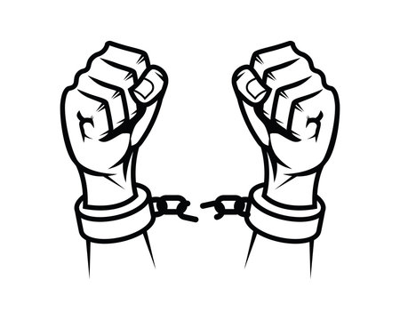

Do 20.3.2025

# Nachtrag zur Beschwerde

Akte 2 XVII 914/24

Zu meiner Beschwerde vom 23.12.2024.

Amtsgericht Traunstein.

<!--
Fr 14.3.2025 0830
-->

## Ausrede: Wir sind keine Ärzte

Richter bringen
immer wieder die selbe Ausrede:

"Wir sind keine Ärzte,
also können wir nichts sagen gegen Ärzte,  
also wir müssen alles erlauben
was Ärzte fordern."

Das ist so als würden Richter
alles erlauben
was Staatsanwälte fordern weil
"wir sind keine Staatsanwälte".

Ich habe keinen "Hausarzt"
und auch sonst keine Ärzte,  
weil ich brauche keine Ärzte,  
weil ich helfe mir selber,
durch gesundes Essen
(Huel Pulver, Salat, Fleisch)  
und durch Vitamine
(Bulk.com Multivitamin Tabletten
und Omega 3 Kapseln)  
und durch Verzicht auf alle Drogen
(legale Drogen und illegale Drogen).

Ich helfe mir selber, also:  
Ich brauche auch
keinen teueren Gegengutachter  
der den "Richtern"
mit latinischen und griechischen
Zauberwörtern erklärt,
dass ich "gesund und friedlich" bin,  
sondern es reicht,
wenn ich dem "Gutachter" widerspreche,  
dann steht Aussage gegen Aussage,  
dann steht
"selbsternannter Arzt" (Ich)
gegen "fremdernannter Arzt" (Dr. med.),  
und dann gilt:
Im Zweifel für den Angeklagten (Ich).
(Das gilt auch im Zivilrecht.)

Warum ist das so schwer?  
Warum findet ihr
diese politische Verfolgung so lustig?

<!--
Fr 14.3.2025 0820
-->

## Zauberwort: unauffällig

Die "Ärzte" sagen immer wieder:  
"der ist unauffällig".

Übersetzung:  
"der ist gesund".

Aber so direkt
dürfen die Ärzte das nicht sagen,  
sonst verlieren sie einen "Kunden",
also sonst verlieren sie Geld.

Schulmedizin:  
Ein geheilter Patient
ist ein verlorener Kunde.

<!--
Fr 14.3.2025 0840
-->

## Wie lange noch 1

Wie lange dürfen die "Ärzte"
mich noch "behandeln" (foltern)
bis die "Richter" verstehen:  
bin nicht heilbar
weil ich bin schon gesund.  
(Die "Ärzte" werden das nie zugeben!)
(Die "Ärzte" sind gefangen in Lügen.)

Bei mir gibt es keine "Krankheit"  
die man mit lebenslanger Abhängigkeit
von Beruhigungsmittel "heilen" kann.

Was die "Ärzte" als "krank" sehen  
ist mein angeborener
und lebenslanger Persönlichkeitstyp,  
den die "Ärzte" als Geldquelle (Melkkuh)
versklaven wollen.

Schulmedizin:  
Ein geheilter Patient
ist ein verlorener Kunde.

Also soll das lebenslang so weitergehen?!  
Immer wieder 6 Wochen, 6 Monate, 12 Monate, ...  
als hätte ich nichts besseres zu tun.  
Doch, habe ich!  
Ich will weiter mein Buch verteilen,
bis ich weiß:  
Ist meine Hypothese wahr oder falsch?

<!--
Fr 14.3.2025 0842
-->

## Wie lange noch 2

Die “Richterin" Frau Tomaschko
hat gesagt  
"das kann schon Mal zwei Jahre dauern."

Bei Gustl Mollath
hat es sieben Jahre gedauert,  
bis Bullen Beweise gefunden haben
für seinen "paranoiden Wahn"  
und bis ein Arzt (Herr Weinberger)
zugegeben hat "der ist gesund".  
(Dafür wurde Herr Weinberger
verstoßen vom "System".)

Bei mir hat es
circa 6 Monate gedauert im Jahr 2017,  
und 2 Monate im Jahr 2010

## Wie lange noch 3

Die legale Droge "Abilify" (Aripiprazol)
nehme ich seit dem 6.3.2025,  
also jetzt (20.3.2025) seit 2 Wochen.

Wo bleibt die Wirkung?  
Was soll das bringen?

Ich merke nichts, auch keine Nebenwirkungen.

Das soll jetzt also noch 4 Wochen so weiter gehen,  
dann werden die "Ärzte" wieder sagen
"das hat nichts gebracht".

Dann werden die "Ärzte" noch Clozapin probieren für 6 Wochen,  
uns auch das wird nichts bringen.  
(Wollen wir wetten?)  
(Wir wetten hier schon die ganze Zeit, Einer gegen Alle...)

Also noch mindestens 10 Wochen
"Menschenversuche" mit legalen Drogen.

Was wenn den "Ärzten" die Drogen ausgehen?  
Probieren wir dann "alternative" Drogen wie Meskalin oder LSD oder Ketamin?  
Oder geht das Spiel dann wieder von vorne los?  
Haldol, Zyprexa, Abilify, Clozapin,  
Haldol, Zyprexa, Abilify, Clozapin, ...

Fällt euch nicht langsam auf
wie blöd das alles ist?  
... wie verlogen diese "Ärzte" sind?

<!--
Fr 14.3.2025 1430
-->

## Jung oder alt

Wer als Junger kein Kommunist ist,  
der hat kein Herz.  
(Kommunist ist Typ 1 bei Hans Eysenck.)  
(Herz ist ein Symbol für Typ 1.)

Wer als Alter noch Kommunist ist,  
der hat keiner Verstand.  
(... der ist "schizophren".)

<!--
Wer mit 20 Jahren kein Kommunist ist,
hat kein Herz.  
Wer mit 30 Jahren noch Kommunist ist,
hat keinen Verstand!  
https://falschzitate.blogspot.com/2019/07/wer-mit-20-jahren-nicht-sozialist-ist.html
-->

Warum bin ich besonders?  
Weil ich habe
mich nicht verloren in Systemkritik,  
sondern ich habe auch
einen Lösungsvorschlag gefunden.  
("Ausweg gefunden".)

Problem und Lösungsvorschlag
statt nur Rumheulen.

Wer gegen mich kämpft,
der ist ein dummer Emo,  
der kennt nur persönliche Gründe,
der ist unfähig für sachliche Diskussion.  
(Small minds discuss people.)  
(Kill the messenger.)

<!--
Do 6.3.2025 0820
-->

## Zauberwort Schizophrenie 1

(Bild: Broken Handcuff as Symbol of Freedom)

<!--
https://duckduckgo.com/?q=broken+handcuffs+chain&iax=images&ia=images
.
https://ar.inspiredpencil.com/pictures-2023/slavery-broken-handcuffs
https://www.dreamstime.com/broken-handcuff-as-symbol-freedom-silhouette-style-vector-image193366897
https://www.alamy.com/broken-handcuff-as-symbol-of-freedom-with-silhouette-style-image549111915.html
Broken Handcuff as Symbol of Freedom with Silhouette Style Vector
-->

Schizo | Frenia
---|---
Bruch | Ketten
Gebrochene | Ketten
Gebrochene | Zügel
Ausbruch | Gefängnis
Runaway | Slaves
Entlaufene | Sklaven
nicht zahlende | Schuldner
Verlorene | Beherrschung
Schlechter Ruf | in schlechten Kreisen
keine | Angst
ungläubig gegen | die Regierung
angstfrei gegen | die Bullen
angstfrei gegen | den Polizeistaat

<!--
Mi 5.3.2025 0900
-->

## Zauberwort Schizophrenie 2

- Schwache Selbstbeherrschung
- Verlorene Beherrschung (Wer beherrscht wen?)
- Kontrollverlust (Wer kontrolliert wen?)
- Ausbrecher aus dem Gedankengefängnis ("Matrix")
- Ausbrecher aus der Sklavenmoral (Religion)
- Ausbrecher aus dem Angstgefängnis
- Angstlose
- Angstfreie (Freiheit von Angst)
- Freche
- Ungezogene
- Schwer erziehbar
- Gildenlose Magier
- Eigensinnige Herren
- Feindliche Herren (feindlich gegen wen?)

Schizophrenie-"Kranke" sind Typen 3401
die man "heilen" will zu Typen 3402. 

Aber bei Typ 1 versagt dieses System.  
Typ 1 ist hier nicht "heilbar"
weil der Typ 102 existiert nicht.  
(Typ 102 = Grundtyp 1 und Subtyp 2.)  
(Deswegen 12 Sternzeichen und nicht 16.)  
(Typ 1 und Typ 2 sind Gegentypen.)

Ich bin also ausgebrochen
aus euerem "Gefängnis für den Verstand"
("Matrix")  
und zur Strafe wollt ihr jetzt
meinen Körper möglichst lange wegsperren.

<!--
Mi 19.3.2025 1720
-->

### Paralleljustiz

... also wenn ich "Schizophrenie habe"  
dann ist das keine "Krankheit"  
sondern ein legaler Zustand  
den meine Gegner in diesem Prozess  
auf dem Umweg der "Medizin"
kriminalisieren wollen.  
Also Paralleljustiz.

<!--
Mi 5.3.2025 0840
-->

## Dopamin-Hypothese

Die Dopamin-Hypothese der Schizophrenie
passt zu Typen 34  
die ihr "typisches Ungleichgewicht"  
also ihren "typischen Mangel"  
bei Dopamin und Serotonin haben.  
(Buch: Julia Ross - Mood Cure.)

Dopamin-Hypothese:  
Deswegen wollen die "Ärzte"
mich "behandeln"
mit Dopamin-Hemmern  
(Haldol, Clozapin, Zyprexa, Ciatyl, Abilify, ...)

Müssen die "Ärzte"
wirklich alle Dopamin-Hemmer probieren,  
bevor die "Ärzte" zugeben
dass mein Dopamin-Stoffwechsel nicht gestört ist?  
Wie viele künstliche Dopamin-Hemmer gibt es noch?

Naturmedizin wie Tryptophan zum Serotonin-Aufbau  
(Serotonin als Dopamin-Hemmer)  
kennen diese "Ärzte" nicht,  
weil auf solche Naturstoffe gibts keine Patente,  
also kein Geld für Ärzte und Pharmaindustrie.  
Deswegen: Wer wirklich "gesund" sein will, der muss sich selber helfen,  
das heisst vor allem: gesund essen,  
ein gesunder Körper entsteht dann automatisch.

## Dopamin-Hemmer

<!--
Di 18.3.2025 0230
-->

Bis jetzt haben die "Ärzte"
in ihrem "Menschenversuch" mit mir  
schon mehrere Dopamin-Hemmer probiert:

1. Haldol
2. Zyprexa
3. Clozapin
4. Ciatyl
5. Abilify

... und für mich sind das alles nur "Placebos"  
also die haben bei mir keine Wirkung.

<!--
Di 18.3.2025 0235
-->

Weil ich habe keine Störung
in meinem Dopamin-System.

Also weil ich habe keine Schizophrenie,  
egal wie viele "Ärzte"
diese Lüge noch wiederholen.

Warum soll ich lebenslang "Gift fressen"  
nur weil die "Ärzte" ihre Fehldiagnose
nicht zugeben können?

<!--
Di 18.3.2025 0320
-->

## Zauberwort Psychose

"Sie sind psychotisch!!"  
&mdash; die "Ärzte"

Nationalsozialisten hassen Psychotiker.

Nationalsozialisten haben  
Grundtyp 3 (Sozialisten)  
und Subtyp 2 (nationalistisch).  
(Diese übersetzung
kommt von Hans Eysenck.)

Also "Nazis" sind extrem neurotisch  
(Typen 23 sind Neurotiker)  
also das Gegenteil der Typen 104 und 401,  
diese Typen sind extrem psychotisch  
(Typen 14 sind Psychotiker).  
(Mein Typ ist M104.)

Für "Nazis" sind diese Typen
sowas wie "Untermenschen"
die man versklaven darf.

## Zitate: Wahrheit und Lügen

"Die revolutionärste Tat ist,  
immer das laut sagen, was ist."  
&mdash; Rosa Luxemburg, Ferdinand Lassalle

"Die Regeln sind ganz einfach:  
Sie belügen uns,  
wir wissen, dass sie lügen,  
sie wissen, dass wir wissen, dass sie lügen,  
aber trotzdem lügen sie weiter,  
und wir tun weiter so, als würden wir ihnen glauben."  
&mdash; Elena Gorokhova - Goodbye Leningrad  
(ein Bericht aus der sowjetischen Diktatur)

----

Mit erhobenem Schwert ⸸

Milan Hauth
