# Owners of Empire - The Vatican, the Crown and the District of Columbia

2014-01-18

from TabuBlog Website

<blockquote>

The Mad Hatter:  
Have I gone mad?

[Alice checks Hatter's temperature]

Alice:  
I'm afraid so.  
You're entirely bonkers.  
But I'll tell you a secret.  
All the best people are.

</blockquote>

"Since I entered politics, I have chiefly had men's views confided to me privately. Some of the biggest men in the United States, in the field of commerce and manufacture, are afraid of something.

They know that there is a power somewhere so organized, so subtle, so watchful, so interlocked, so complete, so pervasive, that they had better not speak above their breath when they speak in condemnation of it."
Woodrow Wilson

28th President of the United States

[The New Freedom](http://www.gutenberg.org/files/14811/14811-h/14811-h.htm), 1913

"The very word "secrecy" is repugnant in a free and open society; and we are as a people inherently and historically opposed to secret societies, to secret oaths and to secret proceedings...

Our way of life is under attack. Those who make themselves our enemy are advancing around the globe... no war ever posed a greater threat to our security.

If you are awaiting a finding of "clear and present danger," then I can only say that the danger has never been more clear and its presence has never been more imminent...

For we are opposed around the world by a monolithic and ruthless conspiracy that relies primarily on covert means for expanding its sphere of influence - on infiltration instead of invasion, on subversion instead of elections, on intimidation instead of free choice, on guerrillas by night instead of armies by day.

It is a system which has conscripted vast human and material resources into the building of a tightly knit, highly efficient machine that combines military, diplomatic, intelligence, economic, scientific and political operations.

Its preparations are concealed, not published. Its mistakes are buried, not headlined. Its dissenters are silenced, not praised.

No expenditure is questioned, no rumor is printed, no secret is revealed."
John F Kennedy

35th President of the United States

from a speech delivered to the American Newspaper Publishers Association on April 27, 1961

and known as the "Secret Society" speech - [click here](http://wakeup-world.com/2011/05/20/jfks-speech-on-secret-societies/) for full transcript and audio.

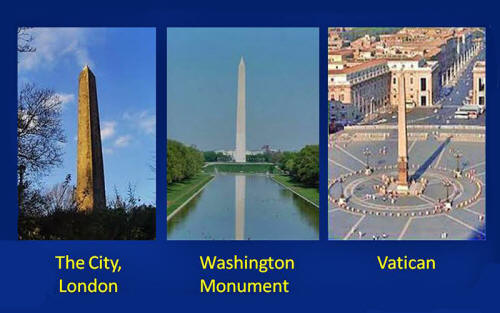

Located in the center of each city is an Egyptian obelisk erect.

They are:

- the obelisk in St. Peter's Square
- the Washington Monument
- Cleopatra's Needle in the City of London

Of course, one question you might want to ask yourself is why is there an Egyptian obelisk, which is a tribute to the Egyptian "pagan" sun god Amen-Ra, in the middle of Vatican City?

Contained within these three cities is more than 80% of the world's wealth.

The [Empire of "The City"](https://www.bibliotecapleyades.net/sociopolitica/esp_sociopol_911_68.htm) is essentially the British Empire, or more accurately, the forces behind the British Empire of the past. The Empire asserts its control over its colonies (such as the U.S., Canada, Australia, the European Union) through complicated means.

One of their means of control is to have agents of their cause in high places of influence.

This cabal of powerful manipulators is known collectively as,

- [the Illuminati](https://www.bibliotecapleyades.net/esp_sociopol_illuminati.htm)
- [the Shadow Government](https://www.bibliotecapleyades.net/esp_sociopol_secretgov.htm)
- the Omega Agency
- the Government within the Government,

...and so on. It does not matter what they are called.

They are there and have been actively and legislatively writing away our freedoms and also have been working towards the New World Order.

Examples of this is,

- the Patriot Acts
- H.R. Bill 1955
- the European Union Constitution
- Security and Prosperity Partnership

Obelisks are phallic shaped monuments honoring the pagan sun god of ancient Egypt called Amen Ra (sun rays) - spirit of this pagan god is said to reside within the obelisk.

The stranglehold Empire Cities have over humanity is achieved through secret societies such as Freemasons (Scottish Rite & Prince Hall) - members are "blood brothers" having sworn to "ever conceal and never reveal" the principle secret, which is the "G" in center of "compass and square" represents Lucifer and they are his soldiers which have been given titles of Royalty (exalting them over humanity)... thus they are known as "black nobility"...

The Pilgrim Society interlocks with,

- Committee of 300
- Bilderberg
- Trilateral Commission
- Royal Institute of International Affairs
- its American Branch, Council On Foreign Relations (CFR)

These along with Worldwide Freemasonry form nexus of global management team, which binds Zionist-British hereditary monarchies (Royalty) and Anglo-American plutocracy together (Meet The World Money Power).

Empire States are "sovereign" - operating above all other nation states, whose installed leaders MUST make pilgrimage to Rome and do obeisance before their earthly king.

<blockquote>

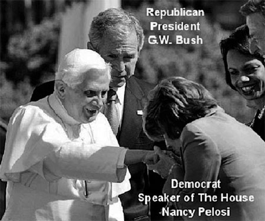

The President of the United States

and a grinning Secretary of State

observe the Speaker of the House

kissing the Pope's ring

</blockquote>

"The real menace of our Republic is the invisible government, which like a giant octopus sprawls its slimy legs over our cities, states and nation...

The little coterie of powerful international bankers virtually run the United States government for their own selfish purposes. They practically control both parties... and control the majority of the newspapers and magazines in this country.

They use the columns of these papers to club into submission or drive out of office public officials who refuse to do the bidding of the powerful corrupt cliques which compose the invisible government.

It operates under cover of a self-created screen [and] seizes our executive officers, legislative bodies, schools, courts, newspapers and every agency created for the public protection."

New York City Mayor John F. Hylan

New York Times, March 26, 1922

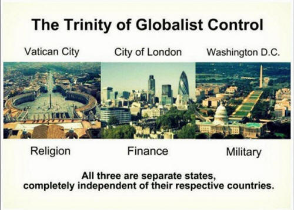

Vatican

Owner of World's Biggest Banks and Top Global Companies Exposed

For those of you who having difficulty believing the information presented in this article, I fully understand.

For the first 57 years of my life, I would not have believed in the possibility that a shadow government could exist. Three years ago my world view changed. While on vacation in Mount Shasta, I came across a book titled "Global Conspiracy" that seemed strangely out of place in a metaphysical book store.

I had never heard of the author before - some guy named David Icke. 

I scanned through the book and frankly didn't believe 99% of what I read. But, I saw one thing that caught my attention in that I knew that I could easily verify Icke's assertion. I did my own research and turned out what Icke had stated was true.

That led me down a rabbit hole and many, many hundreds of hours of independent research. 

Ross Pittman

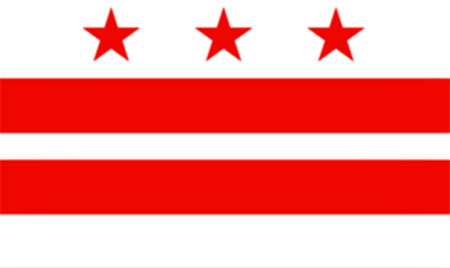

## The Trinity of the Global Empire

- Why is Washington D.C. not a State and legally a separate city-state entity apart from the United States of America?
- Why is the one square mile of the City of London, which has all the banks, with its own Mayor, a separate city-sate entity from all other England?
- Why does the Vatican have its own country code, where the entire city-state entity is guarded by Swiss Guards and shares no laws with Italy?
- Where Switzerland has never been involved in wars, where 'banksters' go for secret accounts to hide their wealth?

The aforementioned city-states listed above are sovereign, corporate entities not connected to the nations they appear to be part of.

In other words, the City of London (that is the square mile within Greater London) is not technically part of Greater London or England, just as Vatican City is not part of Rome or Italy. Likewise, Washington DC is not part of the United States that it controls.

These sovereign, corporate entities have their own laws and their own identities.

They also have their own flags. Seen below is the flag of Washington DC. Note the three stars, representing the trinity of these three city-states, also known as the Empire of the City. (There is also high esoteric significance to the number 3.)

So how are these three cities ultimately connected? We must first go back to the Knights Templar and their initial 200-year reign of power.

The Knights Templar were first called,

> "the Poor Fellow-Soldiers of Christ and the Temple of Solomon."

This is a blatantly misleading title, considering the immense wealth and power of the Templars, who operated 9,000 manors across Europe and owned all the mills and markets.

It was the Templars that issued the first paper money for public use in Europe, establishing the fiat banking system we know today.

In England, the Templars established their headquarters at a London temple, which still exists today and is called Temple Bar. This is located in the City of London, between Fleet Street and Victoria Embankment. The aforementioned "Crown," to be exact, is the Knights Templar church, also known as the Crown Temple.

It is the Crown Temple that controls the legal/court system of the U.S., Canada and many other countries. All bar associations are directly linked to the International Bar Association and the Inns of Court at Crown Temple in the City of London

Anytime you hear somebody refer to the Bar Association, they are talking about a British/Masonic system that has nothing to do with a country's sovereignty or the constitutional rights of its people. This is why, when you go to court in the U.S., you see the U.S. flag with a gold fringe, denoting international rule.

The government of the United States, Canada and Britain are all subsidiaries of the crown, as is the Federal Reserve in the U.S.. The ruling Monarch in England is also subordinate to the Crown. The global financial and legal system is controlled from the City of London by the Crown.

The square mile making up the center of Greater London is the global seat of power, at least at the visible level.

Washington DC was established as a city-state in 1871 with the passage of the Act of 1871, which officially established the United States as a corporation under the rule of Washington, which itself is subservient to the City of London.

Corporations are run by presidents, which is why we call the person perceived to hold the highest seat of power in the land "the president."

The fact is the president is nothing more than a figurehead for the central bankers and transnational corporations (both of which themselves are controlled by High Ecclesiastic Freemasonry) that really control this country and ultimately call the shots.

Washington DC operates under a system of Roman Law and outside of the limitations established by the U.S. Constitution.

Therefore, it should not be a surprise that the name Capitol Hill derives from Capitoline Hill, which was the seat of government for the Roman Empire. If you look at the wall behind the podium in the House of Representatives, you will notice that on either side of the U.S. flag is the depiction of bundles of sticks tied together with an axe.

These are called fasci, hence the root word of fascism. This was the symbol of fascism in the Roman Empire, as it was under the Nazis and still is today. It is not a coincidence that these symbols are featured on the floor of Congress.

Most U.S. citizens believe the United States is a country and the president is its leader, but the U.S. is not a country, it is a corporation, and the president is not our leader, he is the president of the corporation of the U.S.

The president, along his elected officials work for the corporation, not for the American People.

So, who owns the giant U.S. corporation?

Like Canada and Australia, whose leaders are prime ministers of the queen, and whose land is called crowned land, the U.S. is just another crowned colony. Crowned colonies are controlled by the empire of the three city states.

Thus, the U.S. is controlled by the three city states.

<blockquote>

"There exists a shadowy government with its own Air Force, its own Navy, its own fundraising mechanism, and the ability to pursue its own ideas of national interest, free from all checks and balances, and free from the law itself."

Daniel K. Inouye

U.S. Senator from Hawaii, testimony at the Iran Contra Hearings, 1986

</blockquote>

These 3 City-States belong to no Nation and pay no taxes.

They have their own separate laws, own police, mayors, post offices. Their own separate flags and their own separate identities.

### The Religious Control - The Vatican - pop. 1,000 people

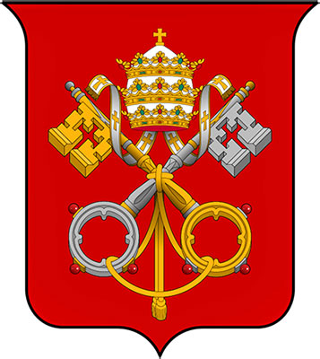

Own newspaper, postal service, library, pop. 1,000. Own army of Swiss Guards and own prison. Rules over 2 billion people.

Wealth is held by,

- The Bank of England (Rothschild) 
- The Federal Reserve Bank (private corporation)

### The Banking Control - The City of London aka The Crown - pop. 11,000 people

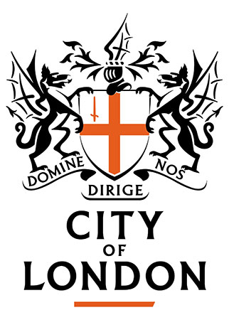

The 'Crown' is not owned by the Westminster and the Queen or England.

> "The City of London has been granted various special privileges since the Norman Conquest, such as the right to run its own affairs, partly due to the power of its financial capital. These are also mentioned by the Statute of William and Mary in 1690."

City State of London is the world's financial power centre and wealthiest square mile on earth - contains Rothschild controlled Bank of England, Lloyd's of London, London Stock Exchange, ALL British banks, branch offices of 385 foreign banks and 70 U.S. banks.

It has its own courts, laws, flag and police force - not part of greater London, or England, or the British Commonwealth and PAYS ZERO TAXES!

City State of London houses Fleet Street's newspaper and publishing monopolies (BBC/Reuters), also HQ for World Wide English Freemasonry and for worldwide money cartel known as The Crown...

<blockquote>

For centuries the Bank of England has been center of the worlds fraudulent money system, with its "debt based" (fiat currency).

The Rothschild banking cartel has maintained tight-fisted control of the global money system through The Bank for Intl. Settlements (BIS), Intl. Monetary Fund (IMF) and World Bank, the central banks of each nation (Federal Reserve in their American colony), and satellite banks in the Caribbean.

They determine w/the stroke of pen the value of ALL currency on earth it is their control of the money supply which allows them to control world affairs (click here for Federal Reserve owners) - from financing both sides of every conflict, through interlocking directorates in weapon manufacturing co.s', executing global depopulation schemes/crusades/genocide, control of food supply, medicine and ALL basic human necessities.

They have groomed their inaudibility through control of the so-called "free press" and wall themselves off w/accusations of anti-Semitism whenever the spotlight is shone upon them.

Their Zionist tentacles reach into every major financial transaction on earth... unchecked power!

</blockquote>

The Crown is NOT the Royal Family or British Monarch.

The Crown is private corporate City State of London - it's Council of 12 members (Board of Directors) rule corporation under a mayor, called the LORD MAYOR... legal representation provided by S.J. Berwin

A Committee of 12 men rule The Jewish Vatican.

They are known as "The Crown." The City and its rulers, The Crown, are not subject to the Parliament. They are a Sovereign State within a State. The City is the financial hub of the world.

It is here that the Rothschilds have their base of operations and their centrality of control:

- The Central Bank of England (controlled by the Rothschilds) is located in The City
- All major British banks have their main offices in The City
- 385 foreign banks are located in The City
- 70 banks from the United States are located in The City
- The London Stock Exchange is located in The City
- Lloyd's of London is located in The City
- The Baltic Exchange (shipping contracts) is located in The City
- Fleet Street (newspapers & publishing) is located in The City
- The London Metal Exchange is located in The City
- The London Commodity Exchange (trading rubber, wool, sugar, coffee) is located in The City

Every year a Lord Mayor is elected as monarch of The City.

The British Parliament does not make a move without consulting the Lord Mayor of The City. For here in the heart of London are grouped together Britain's financial institutions dominated by the Rothschild-controlled Central Bank of England.

The Rothschilds have traditionally chosen the Lord Mayor since 1820. Who is the present day Lord Mayor of The City?

Only the Rothschilds' know for sure...

## How the City of London Came Into Power Inside England

### ENTER THE ROTHSCHILDS

MAYER AMSCHEL BAUER opened a money lending business on Judenstrasse (Jew Street) in Frankfurt Germany in 1750 and changed his name to Rothschild.

Mayer Rothschild had five sons.

The smartest of his sons, Nathan, was sent to London to establish a bank in 1806. Much of the initial funding for the new bank was tapped from the British East India Company which Mayer Rothschild had significant control of. Mayer Rothschild placed his other four sons in Frankfort, Paris, Naples, and Vienna.

In 1814, Nathanael Rothschild saw an opportunity in the Battle of Waterloo. Early in the battle, Napoleon appeared to be winning and the first military report to London communicated that fact. But the tide turned in favor of Wellington.

A courier of Nathan Rothschild brought the news to him in London on June 20. This was 24 hours before Wellington's courier arrived in London with the news of Wellington's victory. Seeing this fortuitous event, Nathan Rothschild began spreading the rumor that Britain was defeated.

With everyone believing that Wellington was defeated, Nathan Rothschild began to sell all of his stock on the English Stock Market. Everyone panicked and also began selling causing stocks to plummet to practically nothing.

At the last minute, Nathan Rothschild began buying up the stocks at rock-bottom prices.

This gave the Rothschild family complete control of the British economy - now the financial centre of the world and forced England to set up a revamped Bank of England with Nathan Rothschild in control.

Ruling 'Committee of 300′ for The 'Crown' names included in the London based corp. are names like:

- Rockefellers
- Gore
- Greenspan
- Kissinger
- Krugman (NYTimes)
- Powell
- Gates
- Buffet
- Bush, etc.

Why are these 'American's' on a foreign committee... because the Crown STILL owns the UNITED STATES CORPORATION, private corporation!

<blockquote>

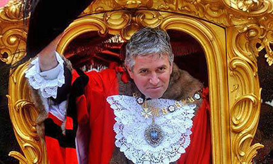

Nick Anstee

Lord Mayor of City of London

Chairman Rothschild Dynasty controlled Crown Corporation

Knight of Malta

Order of Garter

</blockquote>

The Lord Mayor and 12 member council serve as proxies/representatives who sit-in for 13 of the world's wealthiest, most powerful banking families (syndicates) headed by the Rothschild Dynasty they include:

- Warburgs
- Oppenheimers
- Schiffs,

...these families and their descendants run the Crown Corporation of London

Rockefeller Syndicate runs American colony through interlocking directorships in JP Morgan Chase/Bank of America and Brown Brothers Harriman (BBH) and Brown Brothers Harriman New York along with their oil oligarchy Exxon-Mobil (formerly multi-headed colossus Standard Oil).

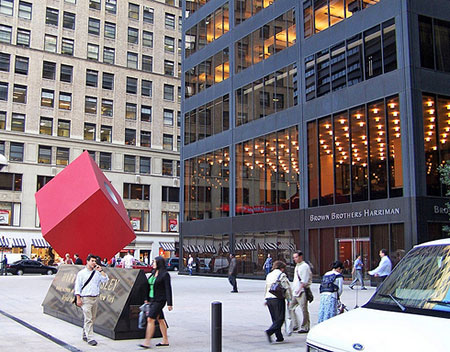

They also manage Rothschild oil asset British Petroleum (BP). The Crown Corporation holds title to world-wide Crown land in Crown colonies like Canada, Australia, New Zealand and many Caribbean Islands.

British parliament and British PM serve as public front for hidden power of these ruling crown families.

<blockquote>

"Today the path to total dictatorship in the U.S. can be laid by strictly legal means... We have a well-organized political-action group in this country, determined to destroy our Constitution and establish a one-party state...

It operates secretly, silently, continuously to transform our Government... This ruthless power-seeking elite is a disease of our century... This group... is answerable neither to the President, the Congress, nor the courts.

It is practically irremovable."

Senator William Jenner, 1954 speech

</blockquote>

<blockquote>

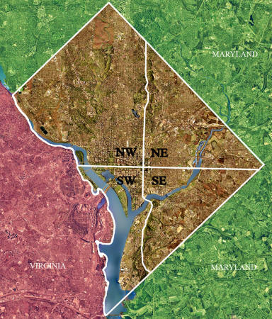

Washington D.C.

Military Control aka The Military/Industrial Complex

</blockquote>

The constitution for the District of Columbia operates under tyrannical Roman law known as "Lex Fori" which bears no resemblance to U.S. Constitution.

When congress passed the act of 1871 it created a separate corporation known as THE UNITED STATES and corporate government for the District of Columbia.

This treasonous act allowed the District of Columbia to operate as a corporation outside the original constitution of the United States and outside of the best interests of American citizens (sheeple). 

POTUS is the Chief Executive of the Corporation of the United States operating as any other CEO - governs with a Board of Directors (cabinet officials) and managers (Senators/Congress).

Obama as others before him, is POTUS, operating as "vassal king" (below video) taking orders from "The City of London" through the RIIA (Royal Institute of Intl Affairs) - read 'District of Columbia Organic Act of 1871'.

Also HERE...

<blockquote>

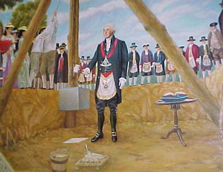

The laying of the

U.S. Capitol cornerstone

by Washington

in full Masonic attire

</blockquote>

The U.S.A. is a Crown Colony, careful study of signed treaties/charters between Britain and U.S. exposes a well-kept secret.

The U.S. has always been and remains a British Crown colony. King James I not just famous for translating the Bible into "The King James Version", but for signing first charter of Virginia in 1606 - which granted America's British forefathers license to settle and colonize America.

Also guaranteed future Kings/Queens of England would have sovereign authority over all citizens and colonized land in America, stolen from Native Americans via genocidal methods.

Its farming industry/infrastructure was developed by Africans "stolen" from their homeland, classified as property and relegated to sub-human status.

After America declared independence from Great Britain, the Treaty of 1783 was signed treaty identifies King of England as prince of U.S. - completely contradicting premise that America won The War of Independence - though King George III gave up most of his claims over American colonies, he kept his right to continue receiving payment for his business venture of colonizing America.

If America had really won War of Independence, they would never have agreed to pay debts and reparations to King of England.

America's blood soaked War of Independence against British bankrupted America, turning its citizens into permanent debt slaves of the King. In the War of 1812, British torched and burned to the ground White House and all U.S. government buildings, destroying ratification records of U.S. Constitution.

Most U.S. citizens have been fooled into thinking U.S. is a country and POTUS is most powerful man on earth.

U.S. is NOT a country, it is a corporation (colony) and POTUS is president of "The Corporation of the United States". He along w/his officers (cabinet officials) and elected officials (congress) work for the corporation, NOT for American people (sheeple, masses, useless eaters etc).

Since U.S. is a corporation, who owns the corporation of the United States? Like Canada/Australia whose leaders are Prime Ministers of the Queen, and whose land is called Crown Land, U.S. is just another crown colony

Crown colonies are controlled by Empire of the three City States.

From Wikipedia:

<blockquote>

The centers of all three branches of the federal government of the United States are in the District, including the,

- Congress
- President
- Supreme Court

Washington is home to many national monuments and museums, which are primarily situated on or around the National Mall.

The city hosts 176 foreign embassies as well as the headquarters of many international organizations, trade unions, non-profit organizations, lobbying groups, and professional associations. A locally elected mayor and 13-member council have governed the District since 1973; however, the Congress maintains supreme authority over the city and may overturn local laws.

The District has a non-voting, at-large Congressional delegate, but no senators. The Twenty-third Amendment to the United States Constitution, ratified in 1961, grants the District three electoral votes in presidential elections.

Congress passed the Organic Act of 1871, which repealed the individual charters of the cities of Washington and Georgetown, and a created a new territorial government for the whole District of Columbia.

President Grant appointed Alexander Robey Shepherd to the position of governor in 1873. Shepherd authorized large-scale projects that greatly modernized Washington, but ultimately bankrupted the District government.

In 1874, Congress replaced the territorial government with an appointed three-member Board of Commissioners.

</blockquote>

<blockquote>

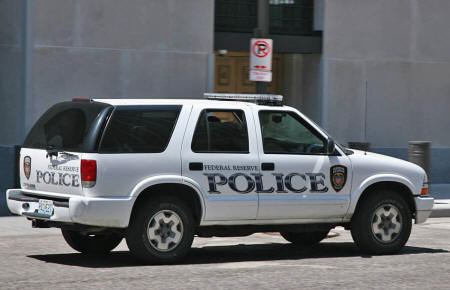

'The Federal Reserve

is no more Federal than Federal Express'

</blockquote>

Another means of control is through the world's Central Banks.

Contrary to popular belief, [the Federal Reserve](https://www.bibliotecapleyades.net/esp_sociopol_fed.htm) (FED) is NOT a part of the U.S. Government.

The only part that is "federal" about it is it's name. It is a privately owned enterprise, and so is the Bank of England, and every central bank out there, including the World Bank.

Interestingly enough, all of these private central banks are owned by largely the same group of people!

This group includes, but is not limited to:

- the Rothschilds
- the Rockefellers
- the Warburgs,

...and their interests.

Essentially what they have is a monopoly on money.

All money that is out there is a loan. The central banks print the money, and then loans it to the government on interest. This is why the national debt of any country grows exponentially. This is because the money that is needed to pay back the loan comes from the central bank.. on loan!

The American national debt is so great right now that every person born into the U.S. is automatically over 70,000 in debt.

This way of control is to make every citizen of the colony a willing debt-slave of the Empire. I foresee that the manufactured economic crisis of right now in the U.S. will be used as grounds to push for a North American Union and the use of a single North American currency (to enslave an entire continent) called the Amero.

In an interview with Jim Lehrer that was aired on PBS' News Hour on September 18, 2007 (below audio), formal Federal Reserve Chairman Alan Greenspan said, essentially, that the Federal Reserve was above the law and that no agency of government can overrule their actions:

<blockquote>

Jim Lehrer:

"What is the proper relationship, what should be the proper relationship between a chairman of the FED and a president of the United States?"

Alan Greenspan:

"Well, first of all, the Federal Reserve is an independent agency, and that means, basically, that there is no other agency of government which can overrule actions that we take.

So long as that is in place and there is no evidence that the administration or the Congress or anybody else is requesting that we do things other than what we think is the appropriate thing, then what the relationships are don't frankly matter."

</blockquote>

The fact that the FED is above the law was demonstrated by current FED chairman, Ben Bernanke, during his appearance before Congress on March 4, 2009 (below video). Senator Bernie Sanders asked Bernanke about $2.2 trillion in American tax dollars that was lent out by Federal Reserve.

Bernanke refused to provide an answer:

<blockquote>

Senator Sanders: "Will you tell the American people to whom you lent $2.2 trillion of their dollars?... Can you tell us who they are?"

Bernanke: "No"

</blockquote>

<blockquote>

"The American mind simply has not come to a realization of the evil which has been introduced into our midst.

It rejects even the assumption that human creatures could espouse a philosophy which must ultimately destroy all that is good and decent."

J. Edgar Hoover

</blockquote>

Just like the IRS!

So we pay taxes (in U.S.) to a privately owned foreign corporation based in the City of London!

When we make a check out for tax payment in CA, we make it out to the 'Franchise Tax Board', a subsidiary of the USA Corporation, a private corporation.

In the USA the Federal Reserve Bank is owned by 8 families, most live in Europe, they pay NO TAX on the Trillions of Interest they generate from the National Debt of the USA, which enslaves the U.S. People.

The IRS is a Collection Arm of the Federal Reserve Bank, the IRS is NOT an Agency of the U.S. Government.

The Federal Reserve is not Federal nor does it have any Reserves, its main asset is the Bonds received from the U.S. Government which give the U.S. Government the power to spend the money created from the monetization of the credit of each American used as collateral and then brought into circulation.

During the Depression of the 1930′s the same Wall Street Bankers received bailouts just as has happened recently.

When will the people of America wake up?

The Independent Treasury Act of 1921 suspended the de jure (meaning "by right of legal establishment") Treasury Department of the United States government. Our Congress turned the treasury department over to a private corporation, the Federal Reserve and their agents.

The bulk of the ownership of the Federal Reserve System, a very well kept secret from the American Citizen, is held by these banking interests:

- Rothschild Bank of London
- Rothschild Bank of Berlin
- Warburg Bank of Hamburg
- Warburg Bank of Amsterdam
- Lazard Brothers of Paris
- Israel Moses Seif Banks of Italy
- Chase Manhattan Bank of New York
- Goldman, Sachs of New York
- Lehman Brothers of New York
- Kuhn Loeb Bank of New York

---

archived from

https://www.bibliotecapleyades.net/sociopolitica/sociopol_globalelite177.htm
