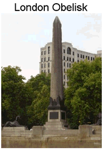

# Three Corporations run the world: City of London, Washington DC and Vatican City

Posted by Shenali D Waduge

On 2014-05-31

World events most of which are 'engineered' leave a trail that leads to the architects. We next discover that there are 3 cities on earth that come under no national authority, they have separate laws, they pay no taxes, they have their own police force and even possess their own flag of 'independence'. These 3 cities control the economy, military onslaughts and the spiritual beings of those in powers. The 3 cities are actually corporations and they are the City of London, District of Columbia and the Vatican. Together they control politicians, the courts, educational institutions, food supply, natural resources, foreign policies, economies, media, and the money flow of most nations as well as 80% of the world's entire wealth. Their ultimate aim is to build a totalitarian rule on a global scale where people will be divided into rulers and the ruled after they have depopulated the world to numbers they wish to rule over. What we need to understand is that the world does not work according to what we have been led to believe. We are drowning in misinformation.

**At the center of each city state are giant phallic shaped stone monuments called obelisks.**

**London obelisk** (aka Cleopatra's Needle):
Located on the banks of the River Thames, this obelisk was transported to London and erected in 1878 under the reign of Queen Victoria. The obelisk originally stood in the Egyptian city of On, or Heliopolis (the City of the Sun). The Knights Templars' land extended to this area of the Thames, where the Templars had their own docks. Either side of the obelisk is surrounded by a sphinx, more symbolism dating back to the ancient world.

In **D.C. the obelisk** is known as the Washington monument was dedicated to George Washington by the secretive brotherhood of Freemason Grand Lodge of the District of Columbia in 1848. They also contributed 22 masonic memorial stones. 250 masonic lodges financed the Washington monument obelisk including the knights templar masonic order.

Vatican obelisk: Located in St. Peter's Square, was moved from Egypt to its current location, in 1586. The circle on the ground represents the female vagina, while the obelisk itself is the penis. This is commonly known as occult symbolism.

**The Roman Empire prevails through the:**

## 1.   CITY OF LONDON INC 

The City of London was formed when the Romans arrived in Great Britain 2000 years ago and started a trading post on the River Thames. Exactly 1000 years later William the Conqueror (King William III) gave sovereign status to the City of Londoners in 1694 allowing them to continue enjoying separate rights and privileges so long as they recognized him as King. The Kings that succeeded William however, decided to build a new capital city and named it Westminster. There have been numerous instances of the King and the City's Mayor at loggerheads with each other.

**What is peculiar is that laws passed by the British Parliament does not apply to the City of London.**

However the City of London is not an independent nation like the Vatican.

Today the City of London is a one-square mile city. The 2 Londons have separate city halls and elect separate mayors, who collect separate taxes to fund separate police who enforce separate laws. City of London has its own separate flag and crest while London city does not. The Mayor of the City of London has a fancy title 'The Right Honourable the Lord Mayor of London' and rides a golden carriage to Guildhall while the Mayor of London wears a suit and takes a bus. The Mayor of London has no power over the Right Honorable Lord Mayor of London (City of London). What's unique is that the City of London is a Corporation and older than the United Kingdom but has a representative in the UK Parliament through a person known as the 'Remembrancer' who is present to protect the 'City's interests.

**The City of London houses**

- Rothschild controlled 'Bank of England'
- Lloyds of London
- The London Stock Exchange
- All British Banks
- The Branch offices of 384 Foreign Banks
- 70 USA Banks
- Fleet Streets Newspaper and Publishing Monopolies
- Headquarters for Worldwide Freemasonry
- Headquarters for the worldwide money cartel known as 'THE CROWN'

The City of London is controlled by the Bank of England, a private corporation owned by the Rothschild family after Nathan Rothschild crashed the English stock market in 1812 and took control of the Bank of England.

The Queen refers to the City of London Corporation as the 'Firm'  but it is known as The CROWN (not representing the Royalty of Britain). Buckingham Palace is in London but not in the City of London and the City is not part of England.

City of London directly and indirectly controls all mayors, councils, regional councils, multi-national and trans-national banks, corporations, judicial systems (through Old Bailey, Temple Bar and the Royal Courts of Justice in London), the IMF, World Bank, Vatican Bank (through N. M. Rothschild & Sons London Italian subsidiary Torlonia), European Central Bank, United States Federal Reserve (which is privately owned and secretly controlled by eight British-controlled shareholding banks), the Bank for International Settlements in Switzerland (which is also British-controlled and oversees all of the Reserve Banks around the world including our own) and the European Union and the United Nations Organization.  The Crown controls the global financial system and runs the governments of all Commonwealth countries, and many non-Commonwealth 'Western' nations as well (like Greece). The Crown traces back to the Vatican, which is headed by the Pope (who owns American Express)
**In essence the City of London Corporation would become the “One World Earth Corporation” and would privately own the world.**

## 2.   Washington DC (District of Colombia)

Washington DC is not part of the USA. District of Columbia is located on 10sq miles of land. DC has its own flag and own independent constitution. This constitution operates under a tyrannical Roman law known as Lex Fori. DC constitution has nothing to do with the American Constitution. The Act of 1871 passed by Congress created a separate corporation known as THE UNITED STATES & corporate government for the District of Columbia. Thus DC acts as a Corporation through the Act. The flag of Washington's District of Columbia has 3 red stars (the 3 stars denoting DC, Vatican City and City of London).

A look at the various Treaties raises the question of whether US remains a British Crown colony. The basis of this goes back to the first Charter of Virginia in 1606 that granted Britain the right to colonize America and gave the British King/Queen to hold sovereign authority over colonized America and its citizens. Colonized America was created after stealing America from the Native Indians. If America was colonized with British subjects these people are subjects of the British Government.

To negate this was the Treaty of 1783 declaring independence from Great Britain. However, this Treaty identifies the King/Queen of England as the Prince of the United States. (please refer www.treatyofparis.com) Nevertheless, according to the Bouviers Law dictionary in 'monarchicial governments' a subject owes permanent allegiance to the monarch in which case the British subjects in colonized America owed permanent allegiance to the monarch.

The reverse is applicable under Constitutional law where allegiance is owed to the sovereign and to the laws of a sovereign government and natives are both subjects and citizens.

The issue is if a war was fought in 1781 and America became victor why would Britain need to sign a Treaty in 1783? When US has won a war, America should not require the British monarch to cede land and refer to himself as Prince of the Holy Roman Empire and of the United States? There is also the issue of the use of the term 'Esquire' given that it is a title of nobility again showing allegiance to the Queen/King and when Benjamin Franklin, John Jay Esquire and John Adams signing on behalf of the US use the name 'Esquire' it is raising the question of how valid the 1783 Treaty is. John Jay went on to sign the 1794 Treaty between England and US raising again why 13 years after the Paris Treaty the US needs to sign a Treaty with England if US was really 'independent'.

What needs to be further investigated is why US still continues to pay tax to the City if it is a free nation?

The 1794 Treaty signed between England and the US was negotiated by John Jay Esquire who negotiated the 1783 Treaty. The question is why would US need to sign Treaty's with England 13 years after the Paris Treaty of 1783 declaring US independent? Why would Article 6 and Article 12 continue to dictate terms to an 'independent' America?

Further reading of US history would reveal what happened to America when it cancelled the Charter of the First National Bank in 1811 and immediately afterwards 4500 British troops arrived and burnt down the White House, both Houses of Congress, the War Office, the US State Department and Treasury and destroyed the ratification records (signed by 12 US states) of the US Constitution wherein the 13thAmendment was to stop anyone receiving a Title of nobility or honor from serving the US Government. The 1812 war lasted 3 years and the Bank Charter was re-established in 1816 after the ratification of the Treaty of Ghent in 1815. Note:  13th amendment which was ratified in 1810 no longer appears in current copies of the U.S. constitution.

In 1913 the Federal Reserve was passed by US Congress handing over America's gold and silver reserves and total control of America's economy to the Rothschild banksters. The Federal Reserve is a privately owned banking system that does not belong to America or Americans.

It is no better a time to question whether US is a country or a corporation and the US President and officials at the Congress are working for that Corporation and not for the American people. It appears that the US Corporation is owned by the same country that owns Canada, Australia and New Zealand whose leaders are all serving the Queen in her Crown Land and US too has been and remains a crown colony that belong to the Empire of the 3 City States - City of London, Vatican City and Washington DC. **The US president is nothing more than a figurehead for the central bankers and the transnational corporations - both of which are controlled by High Ecclesiastic Freemasonry** from the City of London the home of the global financial system.

## 3.   Vatican City

The Vatican City is not part of Italy or Rome. The Vatican is the last true remnant of the Roman Empire. The State of Israel is also said to be a Roman outpost. The Vatican's wealth includes investments with the Rothschilds in Britain, France and US and with oil and weapons corporations as well. The Vatican's billions are said to be in Rothschild controlled 'Bank of England' and US Federal Reserve Bank. The money possessed by the Vatican is more than banks, corporations or even some Governments and questions why the wealth is not used to elevate at least the Christian poor when it preaches about giving?

Vatican wealth has been accumulated over the centuries by taxing indulgences, some Popes have sold tickets to heaven. Today, they are harvesting souls in Asia as a 3rdmillennium goal.

Together the 3 Cities have under their wing various societies and groups placed globally with their own so that no one contests their global plan and those that do …well all the assassinations will explain what happens.

The Fabian Society is one such entity which written in 1887 is a mixture of fascism, Nazism, Marxism and communism. It is not hard to now imagine that all these 'ideologies' would have also been engineered by the same people. It should come as no surprise then to discover that the Fabian Society is accredited with creating Communist China, Fascism in Italy and Germany and Socialism globally as well. How far people have been fooled and also explains the role played by the Fabian Society in formulating policies for the decolonized British Empire. It would also mean that quite a number of British educated natives given the mantle of leading the newly independent nations would have also been members of the Fabian society. The communist takeover of Russia too is said to be the work of the British Fabian Society financed by the City of London banking families.

A closer look at entities like the Bank Of International Settlements (BIS), International Monetary Fund (IMF), Club Of Rome, The Committee Of 300, the Central 'Intelligence' Agency (CIA), the Council On Foreign Relations, The Tri-Lateral Commission, The Bilderberg Groups, the 'Federal' Reserve System, the Internal Revenue Service(s), Goldman Sachs, Israel and the Israeli lobby, the Vatican, the City of London, Brussels, the United Nations, the Israeli Mossad, and Associated Press (AP) will reveal that they are all part of the Fabian Society which also controls the European Union.

A noteworthy quote is that of Australian Senator Chris Schacht who said in 2001 “You probably were not aware that us Fabians have taken over the CIA, KGB, M15, ASIO  (Australian Security Intelligence Organization), IMF, the World Bank and many other organizations.”

From all this we should realize that NOTHING HAPPENS IN ISOLATION. Therefore, every event however small is engineered and orchestrated by a handful of people who control the world and what goes on in the world.

Together they have been responsible for

1.   Global Warming/Climate change - by creating an environmental catastrophe and winning the Nobel Prize, they have created a public awareness for a 'global government' that gives them the right to take action over national governments. Known as UN Agenda 21 a closer look at its clauses will reveal how people will need to get permission for everything they do - in other words it is being used to control people.
2.   Federal Banking system - The Fabian Society created the Federal Reserve Act in 1913 handing over the US economy to a cartel of international financiers.
3.   Big Pharma - is responsible for drugging the Third World
4.   System of local government - promoting devolution and new concept of regional councils in a bid to increase a revenue generating system. It is within an overall plan to abolish independent sovereign national governments. Britain is divided in 9 separate regions of the EU. The British will be shocked to discover that EU laws take precedence over British laws and if they have doubts they need to ask why the Queen and British PMs have signed Treaties handing over power.
5.  Abolition of property rights - in 1974 at the Habitat Conference private property was identified as a threat to peace and equality of the environment. Using 'environmentalism' as a ploy the quest was to take over earth's resources and place it under a central authority (UN) and issue licenses for payment. Who owns the UN…the same banking families. In 1987 the World Wilderness Congress was held organized by the Rothschild's World Conservation Bank which was set up the same year. The World Bank is likely to be replaced by the World Conservation Bank - the aim is to break down national banks and assets will also be diverted to the new bank which is why there is an aim to merge currencies into 2 or  3 major currency groups and replace them with a new electronic currency which is said to be called the 'earth dollar'. New Zealand has apparently transferred over 34% of its land area into UN Heritage Areas and Conservation Parks and these will all be owned by the same banking families. In 1992 the UN Conference on Environment and Development in Brazil was chaired by Mikhail Gorbachev responsible for dividing the Soviet Union and Maurice Strong, the Rothschild London agent. The topic was Agenda 21 which gave man rights superior to animals, fish, plants, trees and forests.
6.  The Patriots Act, the Human Rights Bill, the European Union Constitution, the Security and Prosperity Partnership are all being manipulated to place power in the control of a few hands. Their plans are plotted annually through the Bilderberg Group and their agents run numerous think tanks that steer Government policy which are funded by the banksters who in real terms run the world. Thus the 13 banking families that run the world control the central banks of the world that print money, give loans on interest and explains how national debt never decreases. Economic crises, oil crisis (simply to increase prices), Arab Springs are all manufactured as are wars. There is a saying that all wars and bankers wars. The danger is when it comes to food as the control is being placed under Monsanto and GMOs. Monsanto is the same company that introduced Agent Orange therefore it is worthwhile reading UN's Codex Alimentarius and the impeding dangers.

**An article by John Christian on THE BANKSTER'S 'WORLD CONSERVATION BANK'and their electronic global currency, the 'Earth Dollar' is worth while reading.**

anticorruptionsociety.com

Please read up on the items mentioned and expand your own understanding.

Shenali D Waduge

---

archived from

https://www.sinhalanet.net/three-corporations-run-the-world-city-of-london-washington-dc-and-vatican-city

---

via

https://duckduckgo.com/?q=City+of+London+conspiracy+theory+rule+world&ia=web

---

via

https://www.youtube.com/watch?v=r6i6z1T0CEo

Catherine Austin Fitts on Iran, Epstein, US Corruption and the Control Grid

2026-03-14

29:30 the people who shut down the straits was the City of London.  
It was the insurance industry that shut down the straits.  
\[Strait of Hormuz, etc]
