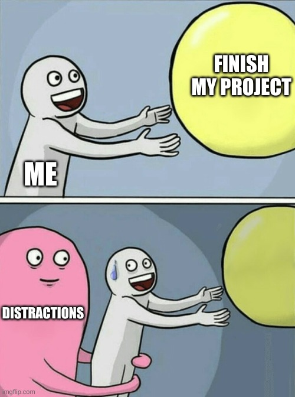

# alchi

**humans and their relations** are the last secret of this world ...

lets decode this last secret!

in our view, **psychology and sociology** must be seen as one science.  
both psychology and sociology are only two sides of one coin.  
this one science is the science of mental chemistry, in short: alchemy

## abstract

our main hypothesis is our compatibility chart:



the compatibility chart works in two ways:

1. i know who i am, but who are my friends?
2. i know my friends, but who am i?

the validity of the compatibility chart can be verified  
in a scientific experiment (experimental psychology).

challenges:

1. measuring of personality type (four basetypes)
2. measuring of "relationship quality" (sympathy, understanding, interpersonal compatibility)
3. invasive experiment. invading into "private" matters, "unethical", therapy by force?
4. city environment is inherently toxic, reinforcing bad habits. ecovillages can provide a better setting,  
but usually, personality types are **not** balanced (the usual "mental incest" and "confirm bias".  
"balanced types" is a hard requirement for this experiment.)
5. our time is running out. world war 3 is only weeks away. (now you can call me a pessimist.)

## packages

this repository is organized as a monorepo of multiple packages

* [src/whoaremyfriends/](src/whoaremyfriends/)
* [src/alchi-book/](src/alchi-book/) - old version of `src/whoaremyfriends/`
* [src/alchi-flyer/](src/alchi-flyer/)
* [src/alchi-tables/](src/alchi-tables/)
* [src/alchi-maps/](src/alchi-maps/)
* [src/alchi-test/](src/alchi-test/)

a monorepo is easier to backup, and usually our readers need all packages

### releases

we try to release all our content as **single file apps**
which can be simply opened in any web browser,  
without [installing node.js](https://nodejs.org/en/download/package-manager/)
and without starting a local web server

[//]: # ( usually with `npm install` and `npm run start` or `npm run dev` )
[//]: # ( cost: larger repository )

we can open markdown files offline with (for example) the [Markdown Preview Plus](https://www.crx4chrome.com/extensions/febilkbfcbhebfnokafefeacimjdckgl/) chrome extension  
(in `chrome://extensions` enable `Allow access to file URLs`)

### recent publications

subscribe to the [RSS feed](https://github.com/milahu/alchi/commits/master.atom) for notifications of project commits,
or use github's [watch repo](https://docs.github.com/en/github/managing-subscriptions-and-notifications-on-github/setting-up-notifications/configuring-notifications#configuring-your-watch-settings-for-an-individual-repository) function

* german flyer: [Hausdurchsuchung gegen Buchdrucker](https://milahu.github.io/alchi/src/alchi-flyer/hausdurchsuchung-gegen-buchdrucker.html) ([mirror: gitlab](https://milahu.gitlab.io/alchi/src/alchi-flyer/hausdurchsuchung-gegen-buchdrucker.html)) ([mirror: codeberg](https://milahu.codeberg.page/alchi/src/alchi-flyer/hausdurchsuchung-gegen-buchdrucker.html)) ([mirror: sourceforge](https://milahu-alchi.sourceforge.io/src/alchi-flyer/hausdurchsuchung-gegen-buchdrucker.html))
  * english title: house search against book printer
  * police are threatening to break into my appartment and steal all my shit, because i am printing an "illegal book". we will see...
* german book: [Pallas. Wer sind meine Freunde. Gruppenaufbau nach Persönlichkeitstyp](https://milahu.github.io/alchi/src/whoaremyfriends/wersindmeinefreunde.html). ([mirror: gitlab](https://milahu.gitlab.io/alchi/src/whoaremyfriends/wersindmeinefreunde.html)) ([mirror: codeberg](https://milahu.codeberg.page/alchi/src/whoaremyfriends/wersindmeinefreunde.html)) ([mirror: sourceforge](https://milahu-alchi.sourceforge.io/src/whoaremyfriends/wersindmeinefreunde.html))
  * english book: [Pallas. Who are my friends. Stable groups by personality type](https://milahu.github.io/alchi/src/whoaremyfriends/whoaremyfriends.html). ([mirror: gitlab](https://milahu.gitlab.io/alchi/src/whoaremyfriends/whoaremyfriends.html)) ([mirror: codeberg](https://milahu.codeberg.page/alchi/src/whoaremyfriends/whoaremyfriends.html)) ([mirror: sourceforge](https://milahu-alchi.sourceforge.io/src/whoaremyfriends/whoaremyfriends.html))
  * rendered PDF files for printing: https://github.com/milahu/alchi-pdf
* german flyer: [Dorfkultur ist Zukunft, aber ... Wer sind meine Freunde?](https://milahu.github.io/alchi/src/dorfkultur/dorfkultur.html) ([mirror: gitlab](https://milahu.gitlab.io/alchi/src/dorfkultur/dorfkultur.html)) ([mirror: codeberg](https://milahu.codeberg.page/alchi/src/dorfkultur/dorfkultur.html)) ([mirror: sourceforge](https://milahu-alchi.sourceforge.io/src/dorfkultur/dorfkultur.html))
  * [villagecults are the future, but ... who are my friends?](src/dorfkultur/villagecults.html.pdf) english version. automatic translation by google translate
  * [google translate](https://milahu-github-io.translate.goog/alchi/src/dorfkultur/dorfkultur.html?_x_tr_sl=de&_x_tr_tl=en&_x_tr_hl=de&_x_tr_pto=wapp). Sorry I don't have a proper english version at the moment.
* visualization: [alchi-maps](https://milahu.github.io/alchi/src/alchi-maps/public/alchi-maps.html) ([mirror: gitlab](https://milahu.gitlab.io/alchi/src/alchi-maps/public/alchi-maps.html)) ([mirror: codeberg](https://milahu.codeberg.page/alchi/src/alchi-maps/public/alchi-maps.html)) ([mirror: sourceforge](https://milahu-alchi.sourceforge.io/src/alchi-maps/public/alchi-maps.html))
* personality test: [alchi-test](https://milahu.github.io/alchi/src/alchi-test/public/) ([mirror: gitlab](https://milahu.gitlab.io/alchi/src/alchi-test/public/)) ([mirror: codeberg](https://milahu.codeberg.page/alchi/src/alchi-test/public/)) ([mirror: sourceforge](https://milahu-alchi.sourceforge.io/src/alchi-test/public/)). combination of multiple personality tests (mostly Big Five), returns result in the four elements (four basetypes)

<details>

* book draft: [Pallas. Extended Families and Small States](https://milahu.github.io/alchi/src/alchi-book/build/) ([mirror: gitlab](https://milahu.gitlab.io/alchi/src/alchi-book/build/)) ([mirror: codeberg](https://milahu.codeberg.page/alchi/src/alchi-book/build/)) ([mirror: sourceforge](https://milahu-alchi.sourceforge.io/src/alchi-book/build/))
  * rewrite: [Who are my friends? Team composition by personality type](https://milahu.github.io/alchi/src/whoaremyfriends/whoaremyfriends.html) ([mirror: gitlab](https://milahu.gitlab.io/alchi/src/whoaremyfriends/whoaremyfriends.html)) ([mirror: codeberg](https://milahu.codeberg.page/alchi/src/whoaremyfriends/whoaremyfriends.html)) ([mirror: sourceforge](https://milahu-alchi.sourceforge.io/src/whoaremyfriends/whoaremyfriends.html))

* 2021-07-29
  * alchi flyer html: [github](https://milahu.github.io/alchi/src/alchi-flyer/alchi-flyer.html)

* 2021-07-06
  * alchi game html: [github](https://milahu.github.io/alchi/src/alchi-flyer/alchi-game.html)

* 2021-05-16
  * alchi book html: [github](https://milahu.github.io/alchi/src/alchi-book/build/), [gitlab](https://milahu.gitlab.io/alchi/src/alchi-book/build/)

* 2021-04-11
  * alchi-book html: [github](https://milahu.github.io/alchi/src/alchi-book/dist/pallas.me-and-my-six-friends.2021-04-11.html), [gitlab](https://milahu.gitlab.io/alchi/src/alchi-book/dist/pallas.me-and-my-six-friends.2021-04-11.html) - first public release - successor of the alchi-flyer
  * alchi-test html: [github](https://milahu.github.io/alchi/src/alchi-test/public/), [gitlab](https://milahu.gitlab.io/alchi/src/alchi-test/public/) - first public release - combine multiple personality tests, show result with the four elements

* 2020-09-01
  * alchi tables html: [github](https://milahu.github.io/alchi/english/alchi-tables.html), [gitlab](https://milahu.gitlab.io/alchi/english/alchi-tables.html)
  * alchi flyer html (german): [github](https://milahu.github.io/alchi/deutsch/alchi-flyer.html), [gitlab](https://milahu.gitlab.io/alchi/deutsch/alchi-flyer.html)
  * alchi-maps 2020-09-02 html+svg+js: [github](https://milahu.github.io/alchi/src/alchi-maps/dist/alchi-maps.2020-09-02.html#A1_e/bxinout_s+m_1110_0_en_np), [gitlab](https://milahu.gitlab.io/alchi/src/alchi-maps/dist/alchi-maps.2020-09-02.html#A1_e/bxinout_s+m_1110_0_en_np) - new: with fotos (format `e/bxfoto`)

* 2020-08-10
  * [finger test - three hands svg](../src/images/finger%20test%20-%20three%20hands.svg) (25 KB) is the most simple test for the three sheldon-types

* 2020-03-10
  * [alcimaps html+svg+js](https://milahu.github.io/alchi/src/alchi-maps/dist/alcimaps.2020-03-10.html) (130 KB)
  * [alcimaps preview webp](https://milahu.github.io/alchi/src/alchi-maps/dist/alcimaps-2020-03-10.html.preview.webp) (68 KB)
  * [alcimaps source code](../src/alchi-maps) (550 KB) for [svelte - the javascript compiler](https://svelte.dev/repl/hello-world)

* 2019-05-13
  * [matrix viewer html+js](https://milahu.github.io/alchi/src/alchi-maps/dist/alchi-matrix-viewer.2019-05-13.html) (22 KB)
  * [matrix viewer screenshot gif](https://milahu.github.io/alchi/src/alchi-maps/dist/alchi-matrix-viewer.2019-05-08.html.M3.gif) (33 KB)

* 2019-04-11
  * [english synth notes txt](alchi%20synth%20english%202019-04-11.txt) (260 KB)
  * [various svg graphics](../src/images) (650 KB)
  * [python script](../src/scripts/alchi-web.py) (20 KB) to render matrix views

</details>

### more content

this project is still a work-in-progress.
ideally, all the text-files and images
would be merged into the alchi-book:

* [english/](english/)
* [deutsch/](deutsch/)
* [src/images/](src/images/) (todo: remove old files)

### permalinks

a note to myself and other contributors:

when moving files, make sure that the old URLs are still reachable

ideally replace the old file with a relative link to the new location, like

```html
<html>
moved to <a href="path/to/new/file.html">path/to/new/file.html</a>
</html>
```

## download

all files and versions can be downloaded with the linux command

```txt
git clone --mirror https://github.com/milahu/alchi alchi/.git
cd alchi
git config --bool core.bare false
git checkout master
git worktree add journal/ journal
xdg-open src/whoaremyfriends/whoaremyfriends.html
xdg-open journal/index.html
```

the `git` program is also available for [Windows, Android, Apple, etc.](https://git-scm.com/downloads/guis/)

this also works with our [repo mirrors](#mirrors)

see also [git clone](#git-clone)

## future work

* english synth (see [src/alchi-book](src/alchi-book))
* handout = one page summary (see [de](deutsch/alchi-flyer.html) and [en](english/alchi-flyer.en.html), but they are very hard to read)
* video (for example: how to [Construct the Map Of Sixteen Types](src/alchi-book/src/pages/page-020.html) from scratch)
* proof of concept

## work in progress

finishing my project is my "running away balloon":

[](src/images/meme.running-away-balloon.finish-my-project-vs-distractions.jpeg)

the closer i get to my finish line, the harder becomes my work,
and that with an exponential increase

i guess that is why broad-tops (fire and air) like me (fire)
need long-tops (earth and water):  
broad-tops easily start new work (find new distractions)
and long-tops easily "get shit done",  
assuming the long-top has experience with this job

## translations

i am in the process of making english the default language

i started this project in german, since german is my native language,
and i wanted to publish my work offline to the people in my region,
to realize and test my concept ...
this approach has failed, since

* most "interesting subjects" (children)
are ridiculously overprotected by their parents, teachers and police
* most people in my region have a ridiculous trust in their government,
so they are zero prepared for the coming collapse

plan B:
publish my work to online communities (doomsday preppers, personality psychology, ...)
where my work can at least be preserved for future generations,
and where my work can be reviewed (at least superficially) by other psychology scholars

the [alchi-book](src/alchi-book/) package is the current focus of my work.
the english and german versions are about 80% ready.
i have already added auto-translations for:
chinese, spanish, russian, turkish, farsi, arabic, czech, hungarian.
adding a new auto-translation with [translate.js](src/alchi-book/scripts/translate.js)
can now be done in five minutes or less.

* [src/alchi-book/scripts/translate.js](src/alchi-book/scripts/translate.js)  
node.js script to export text fragments to [google translate](http://translate.google.com/),
and to import translations back to [src/alchi-book/src/pages/](src/alchi-book/src/pages/).
the imported text fragments look like `<lang.ar rev="en#L1S/h9eR">`
and must be fixed manually, since auto-translate is never perfect.
* [src/alchi-book/src/\_data/metadata.js](src/alchi-book/src/_data/metadata.js) - see `languages`.
this is a space-separeted list of all languages codes for the language menu

## journal

i have scanned some of my hand-written journal.

these are many large files, so they are stored in a separate git branch called `journal`.

when you clone this git repo with `git clone --mirror` then you get all branches.
see also [git clone](#git-clone) and [git worktree add](#git-worktree-add).

## mirrors

in the rare case that this project is censored, here are some mirror locations

* github.com: https://github.com/milahu/alchi + https://milahu.github.io/alchi/
* gitlab.com: https://gitlab.com/milahu/alchi + https://milahu.gitlab.io/alchi/
* codeberg.org: https://codeberg.org/milahu/alchi + https://milahu.codeberg.page/alchi/
* sourceforge.net: https://sourceforge.net/projects/milahu-alchi/ + https://milahu-alchi.sourceforge.io/
* gitea.io: https://try.gitea.io/milahu/alchi
* notabug.org: https://notabug.org/milahu/alchi
* disroot.org: https://git.disroot.org/milahu/alchi
* sr.ht: https://git.sr.ht/~milahu/alchi
* darktea (with [Tor Browser](https://www.torproject.org/download/)): [http://it7otdanqu7ktntxzm427cba6i53w6wlanlh23v5i3siqmos47pzhvyd.onion/milahu/alchi](http://it7otdanqu7ktntxzm427cba6i53w6wlanlh23v5i3siqmos47pzhvyd.onion/milahu/alchi)
* righttoprivacy (with [Tor Browser](https://www.torproject.org/download/)): [http://gg6zxtreajiijztyy5g6bt5o6l3qu32nrg7eulyemlhxwwl6enk6ghad.onion/milahu/alchi](http://gg6zxtreajiijztyy5g6bt5o6l3qu32nrg7eulyemlhxwwl6enk6ghad.onion/milahu/alchi)

note: only some git hosters also offer static webhosting

you may find other mirrors by searching for commit hashes of the [git log](#git-log)

### git log

this may be useful to verify mirrors of this repo

ideally, the old git history should not be modified.
rewriting of new git history may be necessary,
so commit hashes of new commits may change

git log format:

- %H = commit hash
- %T = tree hash
- %ai = author date
- %s = subject

#### last 100 commits

todo: [keep this section up to date](src/scripts/readme-update-last-100-commits.sh)

```
git log --format=' %H `%T` %ai %f' | tac | grep -n '.*' | sed -E 's/^([0-9]+): (.*)$/\1\\. \2  /' | tac | head -n100
```

<details><summary>last 100 commits</summary>

<!-- <last-100-commits> -->

981\. 976dfa610f77d4b9dd97bb169e79e91a5ec82977 `6663f1aafc6bbdfad52bc68a53ae405527fda652` 2023-11-24 08:40:19 +0100 up-sync-git-mirrors.sh  
980\. 05cfcf88c68981a8a6aa1ba662d03034d061e432 `413a273e1ceef685998ff05a64f3f4a3ad0ae303` 2023-11-24 07:46:02 +0100 add-2-empty-pages  
979\. 48be50370bb21246939b77b1d1f7b4c8598e5647 `fc499bb91794b4e8e21063def86aa54866ee2c26` 2023-11-24 07:45:45 +0100 fix-alt-text-of-pallas-symbol  
978\. 6668c3efe3adff1cc3b784b6b19d6821004f96c3 `bcb841e1c1a7f86f16a78f2d0b154f4a641743a0` 2023-11-24 07:45:25 +0100 add-languages-menu  
977\. d75b996de6c127e04b64460ae5580277cac017d9 `e8b53ea2fe6d16af389d7ce4ae55402ea475b2c2` 2023-11-24 07:45:06 +0100 fix-title  
976\. 203231b34e1e43721c27c57a7eedc160155bad40 `46209a6d45e40952d7ca4e9f88fb04d1b08a3249` 2023-11-24 00:30:49 +0000 up-archive-github-issues  
975\. 5f7e9ab6ede14b47d186d4f831a49c907b097b25 `f9a19dda80e7c785cec34d5cb8274b5843872519` 2023-11-15 12:31:09 +0100 up  
974\. b0c77288b87e817f2fbcc67e8733f3bc57836f07 `7ea0c66c08b498900a8083299fb6b0369489583c` 2023-11-15 12:24:24 +0100 fix  
973\. 5112e6c88c197b0478aad8940fc1d81c7d42bc1e `96e35bcdf5ffb94220d2656ac8e8ddb5f2c45f73` 2023-11-14 18:45:28 +0100 fix-print-layout  
972\. 1a7ea9ef15f4cda1975329e6be9604c094b66995 `33107fcaec8c02e805de49f655f7e637c1f93cea` 2023-11-14 18:45:21 +0100 fix-translation  
971\. f958acdaae2472c765f5998f12e2ba13a93bf709 `d3ae2d6f999ab0f28cf741f9de979cc24093236e` 2023-11-14 18:45:01 +0100 up-comment  
970\. 2947eb695123e562e5f84b7380e17dbe374ae584 `95dad2f164258036e494f29aee3d24af57945bd5` 2023-11-14 18:42:16 +0100 rename-mirror-to-righttoprivacy  
969\. 1acee72a9c5f90febc927e38f9233950067181cd `5b2e523880d8a169ef6c0cd813e7ee980800f759` 2023-11-14 18:41:47 +0100 fix-title  
968\. c03e29717ccbdbcc47e7fb962d67d6740b123df2 `ba5e98728301eec9af3bb337f2d230a930893e3f` 2023-11-14 18:23:11 +0100 up  
967\. 4938d4ee7ffd23100684e33d72bac214015adc84 `db3b12ef1014a5507f4d14f8696745878bbe2fa6` 2023-11-14 18:11:56 +0100 up  
966\. 2abd258a570c64f36888ac5d4bfc335f9d122ac3 `ab6da98c1e0508b290c949e1d45a76d8effcdc09` 2023-11-14 17:58:48 +0100 up  
965\. 2c4b25951ee9c932ec7ddc4a32f59c5d8ee4c5b1 `be5d6ffe36d786f7a045560c6f1270eaf9b57338` 2023-11-15 00:31:26 +0000 up-archive-github-issues  
964\. fd684d588077e3f05f479b4a4975cfdd3fa269cd `83d2af46cf277a45236934756c1003efe35bd2a5` 2023-11-14 17:51:18 +0100 up  
963\. e043ac0e052d62ae1f8c5a3626082199e035acf0 `1803d46281b0a9ad1150285078d84d13f35b3647` 2023-11-14 17:50:23 +0100 update-german-version  
962\. f9356650451a732ce96c8fc0ded2450bb71e46b1 `c286ccf7de8ff0ff9c26c91e1e36fe96a46cd162` 2023-11-14 17:50:10 +0100 fix-english-translation.-mostly-done  
961\. c33c5ad569bc48f91530b180a13f1a7ecb399568 `2e6ccc8331ab0f5301a38d4a32b7cbafdd553ef4` 2023-10-26 19:38:12 +0200 fix-english-translation.-WIP.-done-about-30  
960\. 8e01e172dadaa990bd9431809ed7b2d8f08cadcd `b9cd8468ca2efaf9072985b7d1adad1473f1ea23` 2023-10-26 11:49:26 +0200 add-english-translation-from-google-translate  
959\. 1bcabff62baf4463728eb6588043500a980de2bc `5a390ad77d0d39c6b1ac9a0a8b3ddb782954b5c6` 2023-10-17 08:39:26 +0200 fix  
958\. 92464edd72b40bac942f2140083e397033c2cdc9 `1e235d72733b6a36701f4381f9064b6ec84704c3` 2023-10-17 08:43:25 +0200 up  
957\. 80e1c06d29c750da27f536e171be43145c85dd76 `19efd7a06729061fc01c4814bd1fe87b37ce0658` 2023-10-17 08:38:47 +0200 run-refactor-html.js  
956\. 10f41a4305bbf6264ac6a2af789c85026d30f7ff `fdad8adbe6ec8296e1b3459e5c4a804249eb4b06` 2023-10-17 08:38:26 +0200 add-refactor-html.js  
955\. 7f449d018754a89ca36ed3f4b7fbaecbbe6f9820 `71e013ba934c85fbc77f0528a098e3031c3c82dc` 2023-10-17 08:37:42 +0200 up  
954\. 8d3a295254435c4767a17114623c7cbd87b735cf `3d6e3cf910dfd4b71b8691d86064d5b1a138a7bc` 2023-10-17 08:34:28 +0200 up  
953\. 81f43ed049f84ea4d9a863e55e6a0c3104493801 `dee61b4a46fa49fad83fb47061e8553067a3f7b4` 2023-10-17 08:32:26 +0200 up  
952\. b52c63eff0b7b60d2295c390621762187b4470de `f323317f4fdbf30f316cb8b51303381c6601050d` 2023-10-11 18:01:09 +0200 fix-english-translation  
951\. c981f57021a43b237700e962720c9d1a038f5709 `58f3f2c617e595c1d186f750308fef7c7bdd77d8` 2023-10-11 14:55:09 +0200 add-english-translation-from-google-translate  
950\. 02846cf6d2bde84e8658a37a4934109c956ac252 `0df7ba80bb5e9874d6cbfb70621e2450fe17e355` 2023-10-10 09:40:50 +0200 up  
949\. c4350cff047b10312b772ebdb95d206dbadbae76 `f04e7cb7761e582205146de3df839668eb65fd1a` 2023-10-10 09:29:21 +0200 mv  
948\. fcec802a6996a3d4f9f85bd3f35ca69ca8be5233 `7e1319e144d4536f326d3ae7fa19156b7618a9f5` 2023-10-09 21:06:50 +0200 up  
947\. ca5173c6de76125352f708c614354e602a7508d9 `30df3780316aa5fd0c23170cafec6acb545aabe4` 2023-10-09 20:22:51 +0200 up  
946\. 25a3fba78252fb17a0549eeebb043f2c7ada0189 `9ba9a4bf79057401b150898bb18a34ecdd481f89` 2023-10-09 19:29:34 +0200 fix-git-clone  
945\. d4db1f565e5ae98965f4229eca641d273a680d63 `a536f4a91b754b18f8191d40d78b1ea1f947a9e7` 2023-10-09 17:37:26 +0200 up  
944\. 96dbc96e475b15d2080a28d30fa8c95f566e396f `e9fb3516a06c01a1e423bc45426d9b57fcd006d0` 2023-10-07 17:37:44 +0200 add  
943\. a60a4be4770d989fc9a292198424239d54179bc5 `d9d17c27e2fd1eff4e2ff6b0e5e3d3f92fcd4051` 2023-10-07 11:51:42 +0200 lowercase  
942\. a67ce01e02f1252983832f895462829a089083b4 `dea160cef472ec28bcf07f8506985ceb6fe8abf6` 2023-10-07 01:41:51 +0200 up  
941\. 8b3a5eb387bedb21c2834c7fb8cf1a889ff58941 `a169b9b246d452a4b5bfc4b75287bf4dc59129e2` 2023-10-07 01:38:51 +0200 up  
940\. ec332930461763f564c6159673aa92cc8ab3e5a4 `a4f2316d12a49001bcbdf6cbb8160ae6adc86582` 2023-10-07 01:32:49 +0200 up  
939\. 3795644c601b6e1d2cfadb6b0eff82629875da09 `03326b2a2f3f3f94c3f14021dcffd3dad99419a3` 2023-10-07 01:17:57 +0200 up  
938\. 527fd3f9913dae795c7208260ce68acf59107a92 `9aebcd81cce2570f5751f29b3858148785fac5db` 2023-10-07 00:59:35 +0200 add  
937\. 30d3f077495fd112de30678bdac488d1a8291f59 `9c9b1fca6958eb32bff8aecb77b0df8d840d6079` 2023-10-07 00:09:19 +0200 up  
936\. 988c91612e09d82ce3e2d605e1baf5aae06a915d `1c8eb572cd67f2990b3e6368dab64d6bbb49abd4` 2023-10-07 00:04:15 +0200 add-section-git-tags  
935\. 437b416999fde6cf5d67e70e67da6a999f90760e `5250038e84d74ff68c542bc1c8c47ae7df163346` 2023-10-07 00:01:52 +0200 add  
934\. f7e2bfac936fa2d85cb3f446c26fbe3d0f540692 `87bd12d2ca772ede5186907daac95eed48018123` 2023-10-06 22:51:56 +0200 up  
933\. 311ca67dae34803189a7d244697f917deacf28d0 `e53bbd91e408c27d7005c243423c71f408903cd9` 2023-10-06 22:50:00 +0200 move-journal-to-branch  
932\. 8cd1bb8e67be70c530f1313363b53cce477c0b5a `b0242a0b4dfd01fff8553b23e05cac6c1f7d1b1e` 2023-10-06 21:43:30 +0200 add  
931\. 9347784962c306991409a62170c612fd222b460d `b19606f8d9e25a5d80e18228e10e1f36b707923a` 2023-10-06 22:08:32 +0200 add  
930\. ee5c6613a7b7f0dac95f828909daad865ce16bbf `32c38862ad79269af0f58f5dd98ddeac8aead9e4` 2023-10-06 20:32:46 +0200 up  
929\. c29612a110403d4c73dde40ee0a112db0a51b8bd `fb42fa8f0dc368515bbb01d77ff1a40a206c6f0c` 2023-10-04 15:26:10 +0200 add-sections-add-lang-en-unicode-to-ascii  
928\. df83d44502d5555090a187ac477a5cdbe3bf5962 `daffe49f7f27e6dd7a00a398df2877f83d6d630d` 2023-10-04 14:00:38 +0200 up  
927\. 2d7e6c57f666ad0772eefdab38b2aeff3e970bfb `0cb965a7d37a0a56fdee207da83a4f41d705183b` 2023-10-04 14:00:26 +0200 up  
926\. c9d04d8a22839950853a2958e968190c7fe465df `1a7d0113e71a614040ef544b6d9341ea51f38278` 2023-10-04 14:00:11 +0200 up  
925\. f1b16452e8b29365c6bc9dad13db325fbd1144a9 `e1f5293de522af4e6e227726125c4e7189f80227` 2023-10-04 13:59:39 +0200 add  
924\. e692c57925a7a09d9bf9fba549590b2cd93f34f1 `cce729397df8dcc369554b3f4f276e26296e6a43` 2023-10-04 13:59:24 +0200 up  
923\. 9655a984cb730f38f7c30c7812dcd949a3e9520e `f4d0d0e2dc6ac3b0a7bde24cd182441462d941ec` 2023-10-04 13:59:01 +0200 add  
922\. 956739a628996b65d5fd62daefe397083eeb9be8 `894d9d703d9c4b86f4a83f7bde9a690bc56adb93` 2023-10-04 13:58:46 +0200 up  
921\. bbc40bdcfa313b443903b808882d615e51f1f696 `dc02a156461639bac136710ba0e76e2e611890fc` 2023-10-04 13:23:00 +0200 add  
920\. 8b968dba37b22c77faf7869514bb5570b8449a36 `eac61191cbe10eb6368ae81c4920675daded520d` 2023-09-30 01:53:56 +0200 add  
919\. 0138fe91ae1289f2d6e1c0ffa9a8eb4c8890dd8e `f41ce6f8a88c76528c68bd8c5b8fd88584912ace` 2023-09-30 00:28:59 +0000 up-archive-github-issues  
918\. b0fbf70f2c7a4bad77b655a41e2532699682cf5e `2881fecedb7c3cdceefdf70a8b592f14a1111e5f` 2023-09-29 17:57:17 +0200 add-mirror-sourceforge.net  
917\. 66666bfdd17a8379e4e65eba760dafa7f751af2b `d5758b1e8684a23b17499e6f7d645d0d0b44e1a5` 2023-09-24 12:20:25 +0200 up  
916\. 23aaf7c325ed1429a7fac954ce7f982a4905d1b0 `7b6970868310a43c5696036abefafdab493ae51e` 2023-09-24 12:14:21 +0200 up  
915\. 0c590e28f091d7f6737da310dca29f0c2d4f51a9 `5ccb73815f6fc568a23e7f76b0819e44b3ea184d` 2023-09-24 12:05:01 +0200 up  
914\. 6ffd4bee49704848e95031a8258c3396e6f9239b `f013377a7c88b461bd46226d88f9c5e31ad80ffb` 2023-09-24 00:31:43 +0000 up-archive-github-issues  
913\. 34491e9829b56769d3daa3e85c94ffca02c8d577 `4e703e9e24657026a4e6b7571fe0eaab2e19e8a0` 2023-09-23 00:28:16 +0000 up-archive-github-issues  
912\. c0d10fc76e47453aa4c2168a92705b0ff71e71f7 `8a7b50b28a279f9a1d1a3361d2c60fa688f0cfe7` 2023-09-21 00:29:11 +0000 up-archive-github-issues  
911\. 6faa86c1ffbcfdfa856db5b55e73a0a29bfdd145 `aef51be9f47a50822757f6b9662e9a448bb2ca79` 2023-09-14 00:29:16 +0000 up-archive-github-issues  
910\. 6fdf885ca02e875a210f6debde24756da84fe5d6 `f2f7b4e80b41192f5afb01ac48da93e821d5f658` 2023-09-13 00:29:42 +0000 up-archive-github-issues  
909\. 62942604aac910b232fa92f18a3b60debfd7ca5f `94cdf99a24c46287ca8e2a17a2bf35ce9e0cef35` 2023-09-12 15:47:09 +0200 add-section-git-log  
908\. 5c23d477dbf3584896ee0f92d80e6020706d5a1d `2a91283c0e49bbc4c7fd91b36696439ec9044b0b` 2023-09-09 00:28:13 +0000 up-archive-github-issues  
907\. 5af1dbe3ebc19ed6e52ed4da5a57b354b76cfa41 `3232805eea0d80794ba2ab9ea450496fe0cc00b4` 2023-09-05 08:06:21 +0200 issues2md-be-quiet  
906\. 2cdc0f3b3ac3bbe0f13a1c5038a20143fbae8ccc `98ee835656d8563ebd54e91970ae19e8af7f9535` 2023-09-05 08:04:50 +0200 issues2md-build-index.sh-be-quiet  
905\. ad60c52dbb1583d7a85b935742ffeed172b35cad `6c71d92dd01af9b91823217b6e6a3c4db86badcb` 2023-09-05 06:02:04 +0000 up-archive-github-issues  
904\. f6fff902bf524e037e02ca3436b84e0ff76f7535 `e83ced61fb38b02ddee313e8841b0b5a234dd9eb` 2023-09-05 08:00:41 +0200 issues2md-fix-path-to-issues2md-build-index.sh  
903\. d6fee644bb48249b55fdd602890c42b69c004bdc `beb0e1adc340a5eb1141ce208080e2d8fc503763` 2023-09-05 07:59:22 +0200 issues2md-remove-.ghmd-files-to-save-space  
902\. 580c8c9f30a5a18628005ced8652b84d16c33e65 `33315f0c9625d96329a3764e308817db6fe8ed3b` 2023-09-05 07:59:07 +0200 issues2md-remove-nix-to-run-faster  
901\. 68622d5de86f2cdb72bbcc8dadf99b6a3f0ec159 `0d42f71ce7d44df7a513937bd5a5e82b3f80f743` 2023-09-05 07:50:25 +0200 issues2md-allow-to-run-manually  
900\. 880ad00b75376f6cc3fba0588d210162957fd157 `eaccd44a9bcd009cd331eede9c01bab5749c3d7f` 2023-09-05 07:47:21 +0200 add-issues2md-build-index.sh  
899\. db70a2694468d12f6345bb4effbb8f3943654b9d `3de6bdab2ffd303614d5efb56a0eb14ab5cb9486` 2023-09-05 07:29:38 +0200 issues2md-run-only-once-per-day  
898\. d7b8b1cb1d88f41e7edb781849ee3056206d3612 `e52e88e4f950050d60b2a879b62bcf413c40d10d` 2023-08-29 17:15:08 +0200 add-todo-comment  
897\. c739e7596da1d2014c5289e6560db8faaef489e0 `e6789a6909fd1bfdbaea86ed8e2291245d43f6fa` 2023-08-29 15:54:26 +0200 add-link-to-alchi-pdf  
896\. b1ffdcd5dc14527dbee3f6e16a98344f93f03ce1 `3fb3c3af96bc015ae2ef3e277b5a75f410e5cc49` 2023-08-29 15:34:56 +0200 move-sections-fix-layout  
895\. b7991b15dbfc7e149b61b4c031bf7fb319b16d6d `9d05bbf68d11a80b1050275a75b5f9ac37272909` 2023-08-29 11:53:24 +0200 expand-fix-layout  
894\. d9e2e5d3c075a10d39ebfe5454b56dbdb33f6d8c `f1d63059e6f5954067c6458bac07e1c012c734c9` 2023-08-29 11:52:49 +0200 fix-html  
893\. 235d42599d5818c5f73033ad222da7fa22af1df7 `57f2455c13b5c4fb35afa4596b48b29c88cf2049` 2023-08-29 11:52:36 +0200 fix-html  
892\. 9743b50b557039972b830641b941880c3f7de6c1 `fe71280b769fde4194edf0a550e6d1d9e4e3b34e` 2023-08-29 11:43:13 +0200 expand  
891\. 2fd7a6750b02fdcb46eb9878a6dcb5c81a7a22f2 `51c48c02f675b34ff795de396bdc9f4346544ca0` 2023-08-29 11:41:28 +0200 add-comment  
890\. 36b148f0eee5c0331bca78a92acc21107176bef5 `8cbbd685d33c5504eb2beea68414566a57bc3aef` 2023-08-29 11:41:16 +0200 expand  
889\. 3cd71c63e9e04e6dc732d227cf050297b1c0777d `cc8362c7859cafffe375e0176871be7db91beba4` 2023-08-28 21:15:40 +0200 up-sync-git-mirrors.sh  
888\. 5962985a6ce1da2ec3b5e5188ff41afc745adfd5 `9333b292f44fb6ee60aff2d44d9a4a797c6a6813` 2023-08-28 21:11:57 +0200 fix-layout-add-sections  
887\. fa9b657046d1a9f94aab1a85b08562ab3cfd3736 `87e5dfd196918b71d0b762170170478b92f513ba` 2023-08-28 18:39:49 +0200 fix-layout-move-sections  
886\. 4ae1d205df764b2d7542bc1e994a7787f5656839 `b75f4a4f6d8c714865dc4f5a47e4ddd6381ac813` 2023-08-28 17:22:55 +0200 move-sections  
885\. c233ea9e07ab3bf5f17f5779a0d5751323bac08c `12b424ac9ed0bde1e7ed12edb27fe964dbf60a3c` 2023-08-28 17:19:37 +0200 fix-layout  
884\. a412d1570634762f0f3174b8915640edf1010269 `14fa2e0b909dcf556635bed6f635ff62ea61135c` 2023-08-28 15:06:23 +0200 update-version-to-2023-08-28  
883\. 7a11537b77af383f9536482c474c9f6bbba140b5 `6e316f66de0ae0b2e08c86aa2796a52117a1047d` 2023-08-28 14:55:04 +0200 expand-Meine-Todesliste  
882\. a71eeb4025e7b076d5585cf3a35a32103ec9a89f `f1dc2693ac5eb210a914e76dc5e94a13401cf215` 2023-08-28 13:54:36 +0200 fix-layout  

<!-- </last-100-commits> -->

</details>

#### first 10 commits

```
git log --format=' %H `%T` %ai %f' | tac | grep -n '.*' | sed -E 's/^([0-9]+): (.*)$/\1\\. \2  /' | tac | tail -n10
```

<details><summary>first 10 commits</summary>

10\. 918f6358f7457555e8d9432e246dfaf2b5d11a3f `2828d23ab070e2b1e00c9f6013f23c1fb27a624e` 2019-05-10 10:33:09 +0200 Add-files-via-upload  
9\. 8baf376ebb6c2de02acd400a0bdd27846baa94a4 `4bfbd1f0a5853dc095bfbb1e3f2b5ed7e4614454` 2019-05-10 10:26:45 +0200 Update-README.md  
8\. 294b99b08780789de0624b8000983b6b1a9c5dae `15dfb178760799674e6e786a0a7e8e90e778eb83` 2019-05-10 10:22:11 +0200 Add-files-via-upload  
7\. a19773feb290f5b04277dee64aa42ca06379bfa5 `1420b8eb9be0df50ed59d898dbd72c7afd4475a4` 2019-05-04 07:30:36 +0200 Update-README.md  
6\. 034c18a3a5706170a4fb512c3015dd9eaabdd345 `1961e239d20ea7824e45468910d1a7ddb0501450` 2019-05-04 07:28:24 +0200 Add-files-via-upload  
5\. a97352b1af2552a9d166de0876f39f100135a24d `b4e009b85f3d6bd62f3b63d66106a8c9a17dd749` 2019-04-11 19:43:59 +0200 Update-README.md  
4\. 7bb48a5cc4e9dedcfd7acd9d9eb0f724bbe45df2 `cabdeb3e978f54d0711172a45f85808b876ec564` 2019-04-11 19:36:13 +0200 Update-README.md  
3\. 20ef755fc0d3a50c68e8f2833d7b1757fd2836ac `6ee4bbff30aa0ca10a5ba8ac3b81d60c5b79f765` 2019-04-11 19:05:17 +0200 Add-existing-files  
2\. 48127c4f49b3a3954453bb1cffc684d0253e9ae8 `8ade89190989bbb69dcace36688a3a6d33b2274b` 2019-02-19 16:09:32 +0100 Add-files-via-upload  
1\. 9c6e723296fc7d8534cd901de0f0dcfd4765ea3c `6a09968b401196949ba49065701f88d8dcf474e4` 2019-02-19 12:06:18 +0100 Initial-commit  

</details>

#### git tags

todo: [keep this section up to date](src/scripts/readme-update-git-tags.sh)

<!-- <git-tags> -->

11\. b1ffdcd5dc14527dbee3f6e16a98344f93f03ce1 `3fb3c3af96bc015ae2ef3e277b5a75f410e5cc49` 2023-08-28  
10\. adcd827d873f613d7987b153d9df2e58f62a56d0 `58511db7acaae4e2e612f8ab5ab4832ce0645cd6` 2023-06-26  
9\. 51de1ffbcbfdb489e679d3d4ed1de6f552a87b28 `53c039377f30647f1e30f58f96381c12b4e7484a` 2023-06-17  
8\. eb6bf8433f84ca7e39f4bdc89a7d0bea800709f1 `3ba96a038e52e9ac25fc4bd1b9ba35b184621e76` 2022-12-14  
7\. 568f72cde82ef621e553cd763fa935116be5c59e `93460d9973cdd980d762e3610467e9a9b3ab463a` 2022-11-22  
6\. 386182e26c00e3a58bcf0d30d9db144799cd67c5 `04f2fa5d43f4bacc3524d966c6b0b4506af37740` 2022-10-28  
5\. 682fb95f838574408a80576eab9c31bf0b6a78d8 `0d80bf7b8096784ee708050728958d0247afb1c4` 2022-10-27  
4\. efbe1b9e37e38b0c534c7ace9f5be4522ac355be `cb248310aa7565a74b42ddb566839daed6f95f03` 2022-10-05  
3\. 25b2807251fb03b88d4f0b9dd0ce5eca56650812 `9316fe1760dca554016b68262d2db5e8aa827460` 2022-09-30  
2\. a2aecae678b84b863c8c168f4a5dd617694d8b6a `ddf3114c7e4ffc4119403b5b92225464308f3a6d` 2022-09-18  
1\. 9c6e723296fc7d8534cd901de0f0dcfd4765ea3c `6a09968b401196949ba49065701f88d8dcf474e4` init  

<!-- </git-tags> -->

### git clone

use `git clone --mirror` to fetch all branches of a remote

you only need to clone from one remote. later, you can add other remotes with [git remote add](#git-remote-add)

```
# github.com
git clone --mirror https://github.com/milahu/alchi alchi/.git

# gitlab.com
git clone --mirror https://gitlab.com/milahu/alchi alchi/.git

# codeberg.org
git clone --mirror https://codeberg.org/milahu/alchi alchi/.git

# sourceforge.net
# https://sourceforge.net/projects/milahu-alchi/
git clone --mirror https://git.code.sf.net/p/milahu-alchi/code alchi/.git

# gitea.io
git clone --mirror https://try.gitea.io/milahu/alchi alchi/.git

# notabug.org
git clone --mirror https://notabug.org/milahu/alchi alchi/.git

# disroot.org
git clone --mirror https://git.disroot.org/milahu/alchi alchi/.git

# srht
git clone --mirror https://git.sr.ht/~milahu/alchi alchi/.git

# darktea
git -c remote.origin.proxy=socks5h://127.0.0.1:9050 clone --mirror \
  http://it7otdanqu7ktntxzm427cba6i53w6wlanlh23v5i3siqmos47pzhvyd.onion/milahu/alchi alchi/.git
cd alchi
git config --add remote.origin.proxy socks5h://127.0.0.1:9050

# righttoprivacy
git -c remote.origin.proxy=socks5h://127.0.0.1:9050 clone --mirror \
  http://gg6zxtreajiijztyy5g6bt5o6l3qu32nrg7eulyemlhxwwl6enk6ghad.onion/milahu/alchi alchi/.git
cd alchi
git config --add remote.origin.proxy socks5h://127.0.0.1:9050
```

after running `git clone --mirror` you have to convert the bare repo in `alchi/.git` to a normal repo

```sh
cd alchi
git config --bool core.bare false
git checkout master
```

see also https://stackoverflow.com/questions/67699/how-do-i-clone-all-remote-branches

### git worktree add

mount the `journal` branch on the `journal/` folder

```sh
git worktree add journal/ journal
```

now you can read my journal in your web browser

```sh
xdg-open journal/index.html
```

### git pull

to fetch updates, run

```sh
git pull --ff-only
```

or to fetch updates from all remotes, run

```sh
git pull --ff-only --all
```

or use [src/scripts/git-fetch-from-all-remotes.sh](src/scripts/git-fetch-from-all-remotes.sh)

### git remote add

add more remotes by running [src/scripts/git-remote-add-all.sh](src/scripts/git-remote-add-all.sh)

```sh
./src/scripts/git-remote-add-all.sh
```

so if one remote goes down, you can pull updates from another remote

```sh
git branch --set-upstream-to=gitlab.com/master master
git pull --ff-only
```

### tor hidden services

accessing .onion domains requires a running tor client (not the "tor browser"),
usually as a system-wide tor service,
started with `sudo systemctl start tor` on linux,
or `tor.exe --service start` on windows.

see also:

- https://www.torproject.org/
- https://community.torproject.org/onion-services/setup/install/
- https://askubuntu.com/questions/6522/how-to-install-tor

### static mirrors

* archive.org: https://web.archive.org/web/*/https://github.com/milahu/alchi

### discussions

dont worry, its very empty there ...
blame `milahu`, who is just too damn lazy to push his project

* github: https://github.com/milahu/alchi/issues
* gitlab: https://gitlab.com/milahu/alchi/-/issues
* lemmy: https://lemmy.ml/c/alchi
* personalitycafe: [alchi. a general theory of interpersonal compatibility
](https://www.personalitycafe.com/threads/alchi-a-general-theory-of-interpersonal-compatibility.1354920/#post-44121050)

### contact

* gmail: milahu
* protonmail: milahu
* gab: https://gab.com/milahu
* scored: https://communities.win/u/milahu or https://communities.win/u/milahu2
* mastodon: https://freespeechextremist.com/milahu
* galaxy (with Tor Browser): `http://galaxy3m2mn5iqtn.onion/profile/milahu`
* minds: https://www.minds.com/milahu
* facebook: https://www.facebook.com/mila.nautikus (many posts. happy stalking)

if you really want to reach me, better send your request to multiple sites

### absence

In case of milahu's absence ... milahu cannot help you, and you are on your own

milahu does have some enemies, who want him broken, in jail or dead ...

<!-- ^ funny how people misunderstand this. just another intelligence test -->

What milahu has published here is only a part of his hand-written diary,  
but it should be enough information to realize and test his concept

### wrong

In case milahu's concept is wrong:

Let him quote the alchi-book ([src/alchi-book/src/pages/page-150.html](src/alchi-book/src/pages/page-150.html)):

> Doubt: Just a theory / vision / daydream?
>
> When our map is wrong:  
> The 16 types of people are real
> (4 bodies times 4 elements),  
> and when you put them all in one place  
> then they will
> find the natural order by themself
> (self-organisation).  
>  
> Other worldviews are also "just a theory"
> and only because other experiments  
> have been running for a long time,
> they are not automatically better.  
> More competition please!  
>  
> And, trying is better than studying:  
> We can compare a theory
> only after we have tried it.  
>  
> When someone wants to attack a good theory  
> he will distract from the topic
> and argue with false reasons  
> (superficial, formal criticism, pseudo-problems).

<!-- spam

#### keepalive

Technically, milahu could publish "keepalive messages" every day,
but for that he would need a "perfect private key".

In reality, an attacker would only need to torture him,
so he reveals his private key,
and then the attacker could takeover all his accounts (ID theft)

Or milahu could setup a "dead man switch", but ... nah

milahu prefers to rely on his reader's brains,
and he hopes that people [download the full alchi repository](#download),
so they can see the full edit history of all files

An attacker would leave traces in the edit history,
similar to Wikipedia,
or he would have to rewrite the git history,
in that case a `git pull` would fail to update any local files

The best way to authenticate milahu is to meet him in person.
milahu's location is near Munich, Germany.
(See [Contact](#contact))

-->

## keywords

some keywords (tags) for search engine optimization (SEO)

<details>

* [interpersonal compatibility](https://en.wikipedia.org/wiki/Interpersonal_compatibility), intertype compatibility, compatibility algorithm, candidate for a "general theory of interpersonal compatibility"
* [arranged friendship (talk by Dr. Vas Taras)](https://www.youtube.com/watch?v=JlEJbC5k914), prescriptive parenting, invasive parenting, directive parenting, authoritarian education, how should parents select friends for their kids
* who are my friends
  * what is my circle of friends
  * what is my inner circle
* who are my ideal parents
  * who are my ideal teachers
  * who are my ideal students
* matchmaking, procuring, procuration, arranged marriage
* dating platform algorithm
* human combinatorics, human relations
* stable match problem
  * stable matching problem
  * stable marriage problem
  * stable roommates problem
  * game theory
* organization theory
* social psychology
  * psycho sociology
* socionics
  * social engineering
* communication theory
  * systems theory
* small state
  * utopia
  * paradise on earth
* non-calendar astrology
  * calendar astrology is wrong
  * personality type is NOT related to birthday
* alternative to calendar astrology
* what is natural order
* primitive culture
  * minimalism
  * natural religion
  * voluntarism
    * https://en.wikipedia.org/wiki/Voluntarism
    * https://en.wikipedia.org/wiki/Voluntarism_(action) Voluntarism, sometimes referred to as voluntary action, is the principle that individuals are free to choose goals and how to achieve them within the bounds of certain societal and cultural constraints. opposite: actions that are coerced [forced] or predetermined
    * https://en.wikipedia.org/wiki/Voluntaryism (political voluntarism) rejects a totalitarian government in favor of voluntary participation in society, meaning a lack of coercion and force. Voluntaryist principal beliefs stem from the idea of natural rights
    * https://en.wikipedia.org/wiki/Voluntarism_(philosophy)
      * A proponent of metaphysical voluntarism is 19th-century German philosopher Arthur Schopenhauer. In his view, the will is not reasoning, but an irrational, unconscious urge [active, creation, types 13] in relation to which the intellect represents a secondary phenomenon. [passive, rationalization, types 24]
  * [Vernacular culture](https://en.wikipedia.org/wiki/Vernacular_culture) Vernacular culture is the cultural forms made and organised by ordinary, often indigenous people, as distinct from the high culture of an elite. One feature of vernacular culture is that it is informal. Such culture is generally engaged in on a non-profit and voluntary basis, and is almost never funded by the state. The term is used in the modern study of geography and cultural studies. It generally implies a cultural form that differs markedly from a deeply rooted folk culture, and also from tightly organised subcultures and religious cultures. In cultural and communication studies, vernacular rhetoric is the discursive aspect of vernacular culture, referring to "mundane, bottom-up, and informal discursive expressions that challenge and criticize the institutional".
  * [Grassroots](https://en.wikipedia.org/wiki/Grassroots) A grassroots movement is one that uses the people in a given district, region or community as the basis for a political or economic movement. Grassroots movements and organizations use collective action from the local level to effect change at the local, regional, national or international level. Grassroots movements are associated with bottom-up, rather than top-down decision making, and are sometimes considered more natural or spontaneous than more traditional power structures. Grassroots movements, using self-organization, encourage community members to contribute by taking responsibility and action for their community.
  * https://en.wikipedia.org/wiki/Direct_democracy
  * https://en.wikipedia.org/wiki/Cellular_democracy
  * https://en.wikipedia.org/wiki/Community_organizing
  * https://en.wikipedia.org/wiki/Localism_(politics)
  * https://en.wikipedia.org/wiki/Decentralization
  * https://en.wikipedia.org/wiki/Open-source_governance Open-source governance (also known as open politics) is a political philosophy which advocates the application of the philosophies of the open-source and open-content movements to democratic principles to enable any interested citizen to add to the creation of policy, as with a wiki document. Legislation is democratically opened to the general citizenry, employing their collective wisdom to benefit the decision-making process and improve democracy.
    * https://en.wikipedia.org/wiki/Radical_centrism The radical in the term refers to a willingness on the part of most radical centrists to call for fundamental reform of institutions. The centrism refers to a belief that genuine solutions require realism and pragmatism, not just idealism and emotion. One radical centrist text defines radical centrism as "idealism without illusions", a phrase originally from John F. Kennedy. Radical centrists borrow ideas from the left and the right, often melding them together. Some observers see radical centrism as primarily a process of catalyzing dialogue and fresh thinking among polarized people and groups.
    * https://en.wikipedia.org/wiki/Radical_transparency 
* hard problem
  * wicked problem
  * fundamental problem
  * meta problem
  * mother of all problems
  * root of all evil
* master morality
  * seek balance
  * not afraid of radical solutions
  * not afraid of unpopular solutions
  * public domain is saturated with slave morality
    * slave morality?
      * stupid and proud
      * life is a popularity contest
        * seek many friends, dont care about quality
        * fail at quality and compensate with quantity
      * do everything wrong, and still get paid (insurance, welfare state)
      * soft skills over hard skills
      * idealize type 2 + demonize type 1
        * good versus evil
        * god versus devil
* good violence
  * liberating hostages
  * removing children from incompatible parents
    * open adoption: biological parents stay in touch with "their" children, but are not the primary caregivers
* adoption
  * normalize adoption to solve the devil child problem
  * some kids are lucky, their parents are compatible, then a "small family" works
  * other kids have bad luck, their parents are incompatible, then a "small family" fails, and an "extended family" fixes the problem. extended family as in: children and parents choose each other. children have "voting" rights from day one. "voting" is not political. fundamentally, "voting" is about choosing your friends, choosing your relations to other people, instead of passively tolerating a status quo, no matter how bad it is. (false conservatism: holding on to something wrong)
* typical errors
  * some people are vulnerable to "false positive" errors
  * other people are vulnerable to "false negative" errors
  * false negative:
    * false enemies
    * first impression says "he is a enemy" (perceived negative)
    * after review we find "he is a friend" (actually positive)
    * when left alone, the individual will stick to his first impression, and keep his false enemies
    * good at selecting friends = low error rate
      * liberals prefer friends over family
        * [reddit: Liberals, relative to conservatives, express greater moral concern toward friends relative to family, and the world relative to the nation](https://www.reddit.com/r/science/comments/dbynle/liberals_relative_to_conservatives_express/)
          * [2016election.procon.org: Differences in Conservative and Liberal Brains. 20 peer-reviewed studies show liberals and conservatives physiologically different (disgusting image of cutting fingers)](https://2016election.procon.org/view.resource.php?resourceID=005927)
          * Study suggests that leftists have an almost precisely inverted scale of values compared to rightists. Instead of a hierarchy of concern with one’s own family, nation, and race highest on the scale, leftists place abstractions like “all objects in the universe” — including such things as rocks — or “all mankind” — in first place. ([nationalvanguard: Psychology: Liberals Care More About Rocks Than About Their Own Families](https://nationalvanguard.org/2020/07/psychology-liberals-care-more-about-rocks-than-their-own-families/))
          * Liberals as you may suspect are more open to new ideas and are therefore more willing to change.  They are more likely to focus on the good things in change, hoping for the best.  Conservatives tend to be reluctant to change, fearing that change may ruin the good things and bring more problems; unintended consequences.  Such an outlook tends to track with age; younger people tend to be more liberal and older people tend to be more conservative. ([ethicsdefined: Conservatives VS. Liberals](http://ethicsdefined.org/the-problem-with-morality/conservatives-vs-liberals/))
            * "Such an outlook tends to track with age", so this is expression of mental age.
              * type 1 + type 3 = young brain = liberal = driven by lust = positive motivation = seeking types = agressive
              * type 2 + type 4 = old brain = conservative = driven by fear = negative motivation = avoidant types = defensive
      * good at answering the question "who are my friends?"
        * choosy / selective / strong opinions on "what shall we do?" and "what should be?"
        * driver. positive motivation
    * bad at selecting enemies = high error rate
      * dogmatic definitions of enemies
      * others select enemies
    * assumption: type 1 is here. possible expansions:
      * type 1 and type 3? = young brains
      * type 1 and type 4? = boy brains
      * type 1 and type 2? = son-brain and mother-brain
  * false positive:
    * false friends
    * first impression says "he is a friend" (perceived positive)
    * after review we find "he is an enemy" (actually negative)
    * when left alone, the individual will stick to his first impression, and keep his false friends
    * good at selecting enemies = low error rate
        * choosy / selective / strong opinions on "what should we avoid?" and "what should not be?"
    * bad at selecting friends = high error rate
      * dogmatic definitions of friends
      * others select friends
    * assumption: type 1 is not here. possible expansions:
      * type 2 and type 4? = old brains
      * type 2 and type 3? = girl brains
      * type 4 and type 3? = father-brain and daughter-brain
* natural incompatibility
  * devil child
  * problem child
  * black sheep of the family
* fundamental injustice
  * systemic injustice
  * systemic bias
    * systemic bias towards extraverts
    * systemic bias against extraverts
      * [Susan Cain: QUIET. The Power of Introverts in a World That Can’t Stop Talking](https://books-that-can-change-your-life.net/power-of-introverts/)
        * Summary of “Quiet, The Power of Introverts in a World that Can’t Stop Talking”: This book praises the many qualities of the introverted in a society that favours extroversion to excess; there is an overview of current theories on introversion, many tips on how to be happier as an introvert and some ideas on how to find a harmonious balance between introverted and extroverted.
        * define version! what exactly is introversion/extraversion? carl jung says: version is a subtype, so it's variable (same as modality in astrology). (opposed to jungian functions, which are constant = basetype)
  * systemic racism (define race!)
* physiognomy
  * anthropometry
  * body types
  * stigmata
* anthropology
  * science of humans
* sacred geometry
  * natural patterns
* wholistic world view
  * analysis and synthesis
  * hybrid theory
  * both are right
  * balance
  * justice
  * symmetry
* a perfect synthesis
* alchemy
  * humorology
  * four classical elements
  * conjunctio oppositorum (connection of opposites)
* numerology
  * trinity = three modalities = three subtypes
  * quaternio = four elements = four basetypes
* comparative cultural studies
  * meta politics
  * cultural theory
* simple but effective
  * realistic reductionism
  * primitive culture
* intuitive factor analysis
  * the project author is element fire, who dreams to be a benevolent dictator
* border science
  * borderline science
  * between all the worlds
  * wholistic
  * interdisciplinary
* claim of perfection
  * totalitarian approach
  * a theory for every body
* search for the one universal truth
  * monotheism
  * monism
* search for balance
  * dualism
  * polytheism
  * agree to disagree
    * einigkeit in feindschaft (german)
    * unity in hostility
* natural Human Resource Management (HRM)
* small is beautiful
  * small groups
  * small states
  * small cities
  * villages
  * monasteries
  * separatism
  * bottom up
  * start small, stay small
  * dunbar's number 150
    * [exact value for dunbar's number is 144 = 12 x 12 = 3 x 4 x 3 x 4](src/images/dunbar-number--natural-hierarchy--base-twelve-system--natural-coordinate-system.svg)

### more keywords

taken from [src/alchi-book/src/pages/page-005-my-last-words.html](src/alchi-book/src/pages/page-005-my-last-words.html)

* community building
* community organization
* group organization
* offline community
* communism (not socialism!)
* organized resistance
* self organization
* primitive culture
* minimalism
* psychology and sociology
* humans and their relations
* relationship advice
* matchmaking
* mating ritual
* courtship ritual
* spiritual mating
* interpersonal compatibility
* who are my friends
* whoaremyfriends
* where are my friends
* natural order
* natural attraction
* natural sharing of work
* natural division of labor
* mutual completion
* group dynamics
* group movement
* group dance
* group game
* parlor game
* choreography
* dualism
* justice
* balance
* small states
* cultural mosaic
* natural education
* school of life
* post collapse
* family versus friends
* bottom-up organization
* small is beautiful
* paradise on earth
* permaculture
* human resources management
* world formula
* basic principles
* post collapse culture
* post-collapse culture
* village culture
* postmodern culture
* what would noah do?
  * noah's family of eight
  * noah eight family members
  * 8 parents = 4 elements x 2 genders
  * eight parents and eight children are sixteen people
* individualism
  * subjectivism
    * your paradise is our hell
    * your truths are our lies
    * your virtues are our vices
    * government is enemy
    * sick society
    * mainstream is shit
    * mainstream is slave morality
    * slavery was abolished, now all children are slaves by default
    * democracy is tyranny of the stupid majority
    * Rebellion to tyrants is obedience to God (god = nature)
    * idiocracy is here and now
  * moral relativism ([wikipedia: Moral relativism](https://en.wikipedia.org/wiki/Moral_relativism))
    * "descriptive moral relativism holds only that people do, in fact, disagree fundamentally about what is moral, with no judgment being expressed on the desirability of this."
    * "Meta-ethical moral relativism holds that in such disagreements, nobody is objectively right or wrong."
    * "Normative moral relativism holds that because nobody is right or wrong, everyone ought to tolerate the behavior of others even when considerably large disagreements about the morality of particular things exist. "
* [wikipedia: Outsider art](https://en.wikipedia.org/wiki/Outsider_art)
  * self-taught
  * self-initiated
  * unconventional
  * exotic
  * esoteric (not public) (not for society) (not social) (antisocial) (private) (master morality)
  * explicitly anti-conventional, anti-mainstream (most people are idiots)
  * gildenloser magier. guildless magician
    * "Gildenlose dürfen ihre Magie nicht als Dienstleistung verkaufen, da haben die Gildenmagiern ein Monopol." ([src](https://dsaforum.de/viewtopic.php?t=35321))
  * i hate all large groups (societies)
  * raw art
  * rough art
  * primitive art
  * prmitive culture
  * unwritten laws
  * oral tradition
  * most books are shit (bookkeeping always enables bookfaking) (for every good book they print a million bad books) (truth is hidden away from public domain) (epikur: live in private)
  * unpopular
  * antipopulist
  * i want to be right not popular
  * my life is NOT a popularity contest
  * agoraphobia
  * the hermit
  * book of the hermit
  * lone wolf
    * menschlich ein arschloch, aber fachlich brilliant.
      * an asshole to humans, but brilliant in his field.
  * the devil is forever alone
    * "psychiatric hospital patients"
      * i was a psychiatry prisoner for about 2 years
        * political prisoner, actually. see [wikipedia: Political abuse of psychiatry](https://en.wikipedia.org/wiki/Political_abuse_of_psychiatry)
        * my official diagnosis is "paranoid schizophrenic" 
          * schizo-phrenia = broken selfcontrol
            * escaped from the mental prison
            * i see things that other people dont see
              * subjectivism
              * i refuse to believe what society dictates as "normal"
              * i refuse to believe state religion
          * i prefer the diagnosis "intellectual tourette syndrome" because i have zero respect for false authority figures
            * respect is earned by hard work, not by wearing doctor and police costumes
              * credit where credit's due
              * german: ehre wem ehre gebührt
              * the more someone demands respect, the less he deserves it
      * i was in normal jail for 3 years (for growing weed.) (not proud of it, just stating facts.)
        * [Danger Dan - Gesiebte Luft](https://www.youtube.com/watch?v=3wuf09w4HkI)
          * wer mal länger im knast war, der kommt vielleicht zur erkenntnis: der wahre knast ist armut und dummheit
          * who was in jail for a longer time, maybe comes to the conclusion: the real prison is poverty and stupidity
  * art brute
  * rohe kunst
  * Irre - Wir behandeln die Falschen: Unser Problem sind die Normalen
* punk
  * fuck authority 
    * [Pennywise - Fuck Authority](https://www.youtube.com/watch?v=hflx4J_L9cs)
      down with the system. enough of the lies. [Pennywise - Land of the Free (album)](https://www.youtube.com/watch?v=zhKErVfFphQ)
    * Wrong: Why experts keep failing usm and how to know when not to trust them
  * fuck society
    * fuck majority
    * fuck democracy
    * fuck idiocracy
    * [Loikaemie - Good Night White Pride](https://www.youtube.com/watch?v=4ruxmfXoUCE)
      * You pick on the weak  
        You're only strong in groups  
        Can't do shit on your own  
        You pick on those who are few  
        Right winged scum  
        You have no place in our scene  
        Right winged scum  
        We'll teach you what skinhead really means  
      * You're the sickness of our generation  
        You've infested almost every nation  
        You're the plague of our society  
        You're are our most hated enemy  
        Listen what we have to say: Good night white pride  
        Only what we have to say: Good night white pride
* anti kommerz
  * fuck popularity
  * fuck populism
  * fuck mass appeal
  * [MC Rene - Whack und Kommerz](https://www.youtube.com/watch?v=ykRIO0ovgH4&t=238s)
* [mischkultur](https://de.wikipedia.org/wiki/Mischkultur) für menschen
  * Mischkultur ist der gleichzeitige Aufwuchs mehrerer Nutzpflanzenarten auf gleicher Fläche.
  * Mischkultur wird angewendet in Gartenbau, Landwirtschaft und Privatgarten.
  * Mischkultur vermeidet die Nachteile von Monokulturen.
  * Mischkultur, Mischanbau, Mischfruchtanbau, Pflanzengesellschaft ...
  * symbiose: zusammenleben
  * synergie-effekte: ergänzung, arbeitsteilung
  * [companion planting](https://en.wikipedia.org/wiki/Companion_planting) for humans
    * "Companion planting in gardening and agriculture is the planting of different crops in proximity"
    * reasons:
      * pest control
      * pollination
      * providing habitat for beneficial insects
      * maximizing use of space
      * increase crop productivity
    * Companion planting is a form of polyculture.
    * Many of the modern principles of companion planting were present many centuries ago in forest gardens in Asia, and thousands of years ago in Mesoamerica. (traditional agriculture) (traditional culture) (primitive culture) (oral tradition) (schriftlose religionen)
  * "Monokultur" bei Menschen = geistige Inzucht = [Filterblase](https://de.wikipedia.org/wiki/Filterblase) = Echokammer = Echoraum = Komfortzone
    * "Ein verwandtes Konzept ist der Echokammer-Effekt (auch Echoraum genannt, englisch Echo Chamber Effect) in der Kommunikationswissenschaft, der beschreibt, wie es durch den verstärkten virtuellen Umgang mit Gleichgesinnten in sozialen Netzwerken zu einer Verengung der Weltsicht kommt, die zu Bestätigungsfehlern führen kann."
    * "Im Unterschied zu Filterblasen, bei welchen die Personalisierung vor allem durch Algorithmen hervorgerufen wird (pre-selected personalization), wird beim Echokammer-Effekt die Personalisierung vom Individuum selbst vorgenommen (self-selected personalization)."
    * dumm und dumm gesellt sich gern
    * "Auch im Offlinekontext können Phänomene wie soziale Homophilie dazu führen, dass sich beispielsweise politisch homogene Gruppen bilden, in welchen die Mitglieder untereinander hauptsächlich konsonante und bestätigende Informationen teilen und sich gegenseitig weiter bestärken. Dies würde wiederum nicht nur dazu führen, dass kein offener Diskurs unter verschiedenen Menschen mit unterschiedlichen Vorstellungen mehr stattfindet, sondern auch, dass die Öffentlichkeit weiter polarisiert und fragmentiert werden würde."
    * [soziale Homophilie](https://de.wikipedia.org/wiki/Soziale_Homophilie)
      "Soziale Homophilie ist die Tendenz von Individuen, andere Menschen zu mögen und mit ihnen in Interaktion zu treten, wenn diese ihnen ähnlich sind."
      "Alltagssprachlich kann das Phänomen mit dem Sinnspruch "Gleich und gleich gesellt sich gern." zusammengefasst werden."
      * werteorientierte Kriterien:
        * "Werteorientierte Kriterien referieren auf internale Faktoren, die nicht auf den ersten Blick direkt erkennbar sind. Dazu gehören Fähigkeiten, Einstellungen, Überzeugungen, Wünsche und Ziele." (persönlichkeitstyp) (menschentyp) (natürliche stärken und schwächen)
      * "Die Bildung homophiler Gruppen führt zu einer erleichterten Kommunikation innerhalb der Gruppe sowie zu erleichterter Koordination von Handlungen und Aktivitäten."
      * "Gleichzeitig kann es jedoch zu Prozessverlust innerhalb der Gruppe kommen, da die vielen ähnlichen Ansichten zu Gruppendenken führen können. Selektiver Informationsgewinn ist eines der möglichen Resultate."
      * [Gruppendenken](https://de.wikipedia.org/wiki/Gruppendenken)
        * "Gruppendenken ist ein möglicher Prozess innerhalb einer Gruppe. Kompetente Personen treffen dabei schlechtere oder realitätsfernere Entscheidungen, weil jede ihre Meinung an die erwartete Gruppenmeinung anpasst."
        * "Daraus können Situationen entstehen, bei denen die Gruppe Handlungen oder Kompromissen zustimmt, die jedes einzelne Gruppenmitglied unter anderen Umständen ablehnen würde."
        * "Nach Janis ist Groupthink ein „Denkmodus, den Personen verwenden, wenn das Streben nach Einmütigkeit in einer kohäsiven Gruppe derart dominant wird, dass es dahin tendiert, die realistische Abschätzung von Handlungsalternativen außer Kraft zu setzen“."
        * geist der quantität, mehrheitswahlrecht, safety in numbers, mitläufer
        * kollektivismus, sozialismus, faschismus, große gruppen, städte, kirchen, staaten, imperien
        * freiheit wird geopfert zum gewinn von sicherheit
        * harmoniesucht und verlustangst. "lass uns zusammen bleiben." klammern an falsche freunde
        * lieber falsche freunde als keine freunde
        * angst vor einsamkeit, alleine schwach
        " "Für das Management ist es eine schmerzhafte Entscheidung. In der Begründung heisst es: das harmonisches Gruppendenken ist oberstes Ziel in unserer Firma, und wenn wir den hervorragenden Mitarbeiter befördern, dann zerstört das die bestehende Rangordnung der zwischenmenschlichen Beziehungen. Die Manager klagen: Was sollen wir sonst tun?" - William H. Whyte
        * "Caring Culture" vs "Results Culture" in Culture Alignment Framework (CAF) by Spencer Stuart
        * [Gruppennarzissmus](https://de.wikipedia.org/wiki/Gruppennarzissmus)
          * "Die betroffenen Personen behaupten z. B., ihre Nation sei die Beste unter allen Nationen. Dabei sehen sie nur die positiven Seiten ihrer eigenen Nation/Religion/…, wobei sie bei anderen nur Negatives erkennen"
          * verschwörung
            * manche menschen (typen 34?) haben ein natürliche neigung zum aufbau von verschwörungen
            * wer solche verschwörungen bewusst wahrnimmt, der ist für diese menschen ein "verschwörungstheoretiker"
            * grundsatz:
              * deine gefühle sind mein gewissen
              * dein fühlen ist mein wissen
              * unbewusst für dich = bewusst für mich
              * dein spaß = mein ernst
          * faschismus = bündelung zu großer zahl
          * alleine sind wir schwach, gemeinsam sind wir stark
          * "Gruppennarzissmus ist die Übertragung des eigenen Narzissmus einer Person auf eine soziale Gruppe, auf die Nation, auf eine Kirche (religiöser Narzissmus) oder eine Gruppierung, die eine bestimmte Anschauung vertritt u. ä."
          * "Die betroffenen Personen behaupten z. B., ihre Nation sei die Beste unter allen Nationen. Dabei sehen sie nur die positiven Seiten ihrer eigenen Nation/Religion/…, wobei sie bei anderen nur Negatives erkennen"
          * gegenteil: individualnarzissmus = typen 12
            * typ 1 = grandiose narciss = "teufel" = lebendes vorbild für herrenmoral (34x1) = könig der herren
              "Grandiose narcissism is defined by an inflated sense of self-worth and high self-esteem, interpersonal exploitativeness, social dominance and assertiveness, shamelessness and a sense of entitlement derived from feelings of superiority or prestige"
              * beispiel: Friedrich Nietzsche. Tyler Durden.
            * typ 2 = vulnerable narciss = "gott" = lebendes vorbild für sklavenmoral (34x2) = könig der sklaven
              * "vulnerable narcissism, characterized by the personality traits of defensiveness, fragility, social withdrawal, and sensitivity to criticism."
              * beispiel: Ayn Rand.
            * [Narcissistic personality disorder](https://en.wikipedia.org/wiki/Narcissistic_personality_disorder#Grandiose/overt_and_vulnerable/covert)
* melting-pot und kultur-mosaik
  * monoculture vs multiculture
  * moral absolutism vs [moral relativism](https://en.wikipedia.org/wiki/Moral_relativism)
  * objectivism vs subjectivism
    * with multiculturalism, the "subjectivity" is based on race, ethnicity, culture (external factors) ... not on personality type, human nature (internal factors).
    * defenders of multiculturalism say "this is legal for these people, because this is part of their culture. but this is criminal for us, because our culture says this is evil." (positive racism is racism too.)
  * globalismus vs separatismus
  * integration vs ghettos
  * zerstrittene nachbarn vs clankriege, tribe wars, hooligans
  * https://en.wikipedia.org/wiki/Cultural_mosaic
    * "The idea of a cultural mosaic is intended to suggest a form of multiculturalism, different from other systems such as the melting pot, which is often used to describe nations like the United States' assimilation."
    * "Another early use of the term mosaic to refer to Canadian society was by John Murray Gibbon, in his 1938 book Canadian Mosaic. Gibbon clearly disapproved of the American melting-pot concept. He saw the melting pot as a process by which immigrants and their descendants were encouraged to cut off ties with their countries and cultures of origin so as to assimilate into the American way of life."
  * "Since the beginning of the 20th century, Canada has been one of the world's major immigrant-receiving societies. Until the 1960s immigrants were expected to assimilate into the mainstream society. Arriving as it did during a time of social upheaval, Porter's work had a marked influence on Canadian social policy. The view of Canada as a mosaic of cultures became the basis for the Trudeau government's multiculturalism policies in the early 1970s."
* [naturreligion](https://de.wikipedia.org/wiki/Naturreligion_(Begriff))
  * schriftlose Kultur: gefühl ist alles. schrift wird immer nur falsch verstanden.
  * "Der Sammelbegriff Naturreligion ist eine heute von vielen Ethnologen und Religionswissenschaftlern als veraltet und irreführend abgelehnte Bezeichnung für die ethnischen Religionen schriftloser Kulturen. Im Gegensatz zu den gleichfalls beanstandeten Bezeichnungen „Primitivreligion“, „archaische Religion“ oder „Stammesreligion“ wird Naturreligion dennoch in populärer Literatur nach wie vor häufig verwendet."
  * ""Ältere Darstellungen stellen "Naturreligionen" oft den "Kulturreligionen" gegenüber.""
  * "Natur, Primitivität und Zivilisationslosigkeit werden in krassen Gegensatz zu Kultur gestellt."
  * "Die Begriffe Naturreligionen und Naturvölker verweisen außerdem auf einen vermeintlich idealen Urzustand, auf den Traum von der Ganzheitlichkeit des Lebens." (paradies auf erden vs paradies im himmel) (echtes glück vs virtuelles glück) (herrenmoral vs sklavenmoral)
  * "unabhängig von der wissenschaftshistorischen Verwendung bezeichnen auch einige Anhänger neuheidnischer Bewegungen ihre Überzeugung als „Naturreligion“."
  * „Ethnische Religionen werden [von den neuheidnischen Bewegungen] vorwiegend als Naturreligionen wahrgenommen, und der selektive Zugriff auf sie ist Bestandteil spätmoderner Spiritualität.“
  * [Neopaganismus](https://de.wikipedia.org/wiki/Neopaganismus) (neuheidnische Bewegungen)
    * von lateinisch paganus „heidnisch“
    * "religiöse und kulturelle Strömungen, die sich vor allem an antikem, keltischem, germanischem und slawischem Heidentum sowie an außereuropäischen ethnischen Religionen orientieren"
    * "häufig nicht in großen Organisationen zusammengefasst" (kleine gruppen)
    * "Wicca und verwandte Bewegungen sind nach unterschiedlichen Schätzungen von mehreren Tausend mit bis zu 100.000 Anhängern in Deutschland die größte neuheidnische Richtung."
      * "Abwendungen von einer Priesterreligion, Betonung des direkten Glaubenserlebnisses und dezentrale Organisationsform"
      * "Kein dogmatisches Glaubensbekenntnis, stattdessen individualisiertes Erleben von Gläubigkeit und Vielfalt gleichberechtigter Kulte"
      * "Möglichst naturnahe Lebensweise"
      * "Betonung der Freiheit des Einzelnen" (individualismus) (typen 12)
      * "Kritik an monotheistischen, hierarchischen und dogmatischen Religionen wie dem Christentum" (gegenteil: typen 34)
      * dualismus
        * "Hexentum und Wicca: Der Wicca-Glaube wird manchmal, aufgrund seiner Ausrichtung auf die Verehrung von Gott und Göttin, als „Duotheismus“ oder „Bitheismus“ bezeichnet"
      * "Einen großen Einfluss auf den Neopaganismus hatten auch die Theorien des Psychologen Carl Gustav Jung, welcher die verschiedenen Gottheiten als Archetypen der Seele aller Menschen interpretierte."
      * "C. G. Jung wird in vielen Strömungen, wie z. B. Wicca, rezipiert: So wird sein Mutterarchetyp mit der Göttin und der Vaterarchetyp mit dem Gott identifiziert und sogar Jungs Theorie selbst ein inhärenter Paganismus attestiert."
      * paradies auf erden
        * "Viele Neuheiden lehnen allerdings diese theologischen Spekulationen rundweg ab. Wie in den antiken Religionen haben für sie ein bestimmtes Bekenntnis und ein Set von Dogmen keine besondere Relevanz in der Praxis. Viel wichtiger ist ihnen richtiges Handeln, also dass Kulthandlungen sorgfältig und ehrfürchtig durchgeführt werden."
        * realismus. results culture. mesokosmos
        * mikrokosmos ist nicht relevant
        * makrokosmos ist nicht relevant
      * "Die Wurzeln des Neopaganismus reichen zurück bis in die Renaissance, als antike Mythologie und Philosophie wiederentdeckt wurden."
        * "Dezidiert antichristliche Positionen vertrat der byzantinische Philosoph Georgios Gemistos Plethon, der eine zweite platonische Akademie gründete und auf neuplatonischer Basis die alte griechische Religion wiederbeleben wollte."
        * "Wegen ihrer Beschäftigung mit den antiken heidnischen Philosophen wurde vielen Humanisten vorgeworfen, „Heiden“, insbesondere Epikureer, zu sein."
        * epikur: lebe im verborgenen, lebe privat, lebe in kleinen gruppen
      * "Die „Modernisten“ versuchen, vom Stand der heutigen wissenschaftlichen Erkenntnisse ausgehend, eine Religion des Einklangs der beseelten Natur mit dem Menschen - wie in animistischen Religionen - zu leben. Sie bekennen sich dazu, neue religiöse Formen zu erschaffen."
      * "Für das neuheidnische Hexenbild ist die Interpretation von Jacob Grimm am wichtigsten, der in seiner Deutschen Mythologie den Hexenglauben als Ausdruck des naturcultus unserer vorfahren interpretiert und die Hexen auf weise Frauen zurückführte, die in der heidnischen Gesellschaft als Heilkundige, Seherinnen und Priesterinnen eine zentrale Funktion erfüllt hätten."
      * "... neuzeitlichen Hexenverfolgung, welche auch Männer betraf ..."
  * glaube an eine naturordnung
    * natur ist stärker als kultur
    * kindischer eigenwille ist wichtiger als falsche erwartungen von lehrern. schlaue kinder und dumme eltern.
  * Stammesreligion, réligion tribale, tribal religion
  * "Die sogenannten „Stammesreligionen“ werden in vielen Staaten der dritten Welt immer noch als „primitiv und unterentwickelt“ stigmatisiert, zumal die herrschende Klasse dieser Länder in der Regel nach christlichen, islamischen oder kommunistischen Vorlagen ausgebildet wurde. In den Schwellenländern ist die Situation noch ungünstiger, da traditionell lebende Gruppen hier meist als entwicklungshemmend gelten: Entweder werden sie offensiv unterdrückt oder die Errichtung moderner technischer und sozialer Infrastruktur zerstört automatisch das alte Weltbild - und mit ihm die Religion."
  * römer gegen gallier
    * römer gegen germanen
  * [Neo-ethnische Religionen](https://de.wikipedia.org/wiki/Ethnische_Religionen#Neo-ethnische_Religionen)
    * Bildung und Festigung neuer ethnischer Identitäten, die unter anderem durch gemeinsame religiöse Vorstellungen neu begründet werden.
* key to success
  * pallas symbol = key symbol = cross and square = cross and circle
* matchmaking
* pair programming
* pairing
* human compatibility
* compatibility in human relations
* compatibility pattern
* [checkerboard pattern](https://en.wikipedia.org/wiki/Check_(pattern))
* symmetry
* compatibility landscape
* modulo four ring in two dimensions
* pattern of human relations by personality type gender age
* open source education
  * open source school
  * "linux for education"
  * radical transparency
  * voluntarism
  * efficient
  * be excellent to each other
  * be honest
  * speak truth
  * fear no one
  * crowdsourcing
  * open government
  * "social innovation"
  * citizen science
  * amateur science
* artgerechte haltung für menschen
  * artgerechte haltung für menschenaffen
* polyamorie in vierer-gruppen, mann-frau-mann-frau
* polyamory in groups of four people, male-female-male-female
  * the four people must meet certain constraints
  * all four personality types must be present
  * two possible groups of four:
    * F1 M2 F4 M3
    * F2 M1 F3 M4
  * probably all subtypes must be parallel
    * F104 M203 F401 M302
    * F203 M104 F302 M401
    * ... so that all have balanced "inner age", and all have extreme "inner gender"
* Pallas-Pattern
  * Pallas-Muster
  * Tessellation of Square and Irregular Hexagon
    * https://www.tapeten1.de/de/geometrische-tapeten/tpn-710492.html
      * alchi/src/images/tessellations/tapeten1.de--tpn-710492.jpg
      * alchi/src/images/tessellations/tapeten1.de--tpn-710492.large.jpg
      * Stil: Geometrischen Motiven
      * Muster: Geometrie
      * ... also auch kein name für dieses muster
    * non-regular tessellation pattern, because the "hexagon" is no regular hexagon
    * the hexagon has two 90 degree angles and four 135 degree angles
    * https://www.drking.org.uk/hexagons/tess/tess.html
      * almost there https://www.drking.org.uk/hexagons/tess/rt-hex-tess.png
        * The hexagon has all side lengths equal and two opposite angles of 90 degrees
    * To name a tessellation, go around a vertex and write down how many sides each polygon has, in order ... like "3.12.12". Always start at the polygon with the least number of sides, so "3.12.12", not "12.3.12" -- https://www.mathsisfun.com/geometry/tessellation.html
    * Hexagon with two right angles
      * https://artofproblemsolving.com/wiki/index.php/2006_AIME_II_Problems/Problem_1
      * Roche logo (F. Hoffmann-La Roche AG)
        * https://en.wikipedia.org/wiki/File:Hoffmann-La_Roche_logo.svg
        * https://1000logos.net/roche-logo/
  * Waffle Grid
    * https://www.theedkins.co.uk/jo/tess/grids.htm
      * https://www.theedkins.co.uk/jo/tess/waffle.htm
* pattern of attraction for sixteen people
  * pattern of human attraction for sixteen people
  * laws of attraction for sixteen people
* crazy idea
  * crazy ideas
  * crackpot theory
  * smartest man in the world
  * god complex
  * megalomaniac
  * megalomania
  * world formula
  * arrogance
* radical solutions for radical problems
  * a radical solution for a radical problem
  * "radical" as in ...
    * early
      * early childhood
      * early education
      * start of life
    * basic
      * basic needs
      * fundamental
      * simple
      * essential
      * axioms
      * basic research
      * principles
* postcollapse order
  * post-collapse order
  * natural order
  * sustainable order
  * radical justice
  * justice of personality types
* radical solution
  * radical solutions
  * fuck the system, but this time right
  * listen to your heart: overthrow the state
  * there is no political solution
* antisocialism
  * antisocial
  * individualism
  * capitalism (latin "caput" is one head)

<!--

https://kathykwylie.com/2017/03/honeycomb-patchwork/#comment-69145

wtf?

honeycomb is a regular hexagon

but whats the name for the other one?

except "roche logo hexagon" or "irregular hexagon with 90 and 135 degree angles"

i found this irregular hexagon in my research on human relations

https://github.com/milahu/alchi

-->

### german keywords

* systemkritik
   * sklavenmoral gegen herrenmoral
   * sklavenmoral versus herrenmoral
   * sklavenmoral vs herrenmoral
* schulzwang
   * schulpflicht
   * homeschooling in deutschland
   * freilernen
   * freischulen
   * freischule
   * lerngruppen
* selbstorganisation
   * gruppenaufbau
   * gruppenaufbau nach persönlichkeitstyp
   * geführter widerstand
   * bauernaufstand
   * revolution von unten
   * aussteigen aus dem system
   * system-aussteiger
   * querfront
   * staatsfeinde
   * staatsfeindschaft
   * fick den staat
   * fick die schule
   * fick die uni
* verrückt und gefährlich
  * fuck the system, aber diesmal richtig
  * anleitung zum bauernaufstand
  * anleitung zur kulturrevolution
  * anleitung zur revolution von unten
* selbsthilfe
  * wir müssen uns selber helfen
  * wir sind besser dran wenn wir uns selber helfen (Samy Deluxe - Weck Mich Auf)
* freiwilligkeit
  * eine große theorie der freiwilligkeit
  * beziehungen müssen freiwillig sein, also beide seiten dürfen "nein" sagen = beide seiten haben ein vetorecht

</details>
