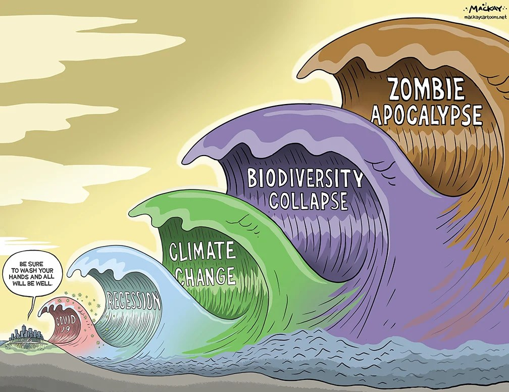

# Problems

1. [Pacifism](pacifism.md)
    1. [Overpopulation](overpopulation.md) - too many people
    1. [Degeneration](degeneration.md) - too many ugly people
    1. [Destruction of nature](destruction-of-nature.md) - killing plants and animals
    1. [Resource depletion](resource-depletion.md) - running out of cheap energy and materials
1. [magnetic pole shift around year 2040](magnetic-pole-shift-2040.md)
1. In 100 million years, an asteroid may hit the earth,
    that is the same size as the asteroid 66 million years ago, that killed all the dinosaurs.
1. In 250 million years, all continents will grow together to form a super-continent,
    there will be more volcanic eruptions and earthquakes,
    solar radiation will become stronger, and temperatures will rise.
    These conditions will make life increasingly difficult for animals and plants,
    and may trigger mass extinctions.
1. In 500 million years, perhaps a gamma ray or supernova will hit Earth and trigger a mass extinction.
1. In 600 million years, solar radiation will become increasingly stronger,
    so that more and more CO2 will be stored in stones.
    There will be less and less CO2 in the air so C3-photosynthesis will no longer work,
    so 99% of today's plants will die.
1. In 1000 million years only single-celled organisms will live on earth, in mountain lakes or in caves.
    So by then, everyone will be dead.

## Waves of Destruction

[meme: Waves of Destruction](https://knowyourmeme.com/memes/waves-of-destruction)

## see also

- [Pallas: No Future](../../whoaremyfriends/whoaremyfriends.html#no-future-we-are-all-going-to-die)
- [Wikipedia: Timeline of the far future](https://en.wikipedia.org/wiki/Timeline_of_the_far_future)
- [Wikipedia: Future of Earth](https://en.wikipedia.org/wiki/Future_of_Earth)
- [Wikipedia: Global catastrophic risk](https://en.wikipedia.org/wiki/Global_catastrophic_risk)
