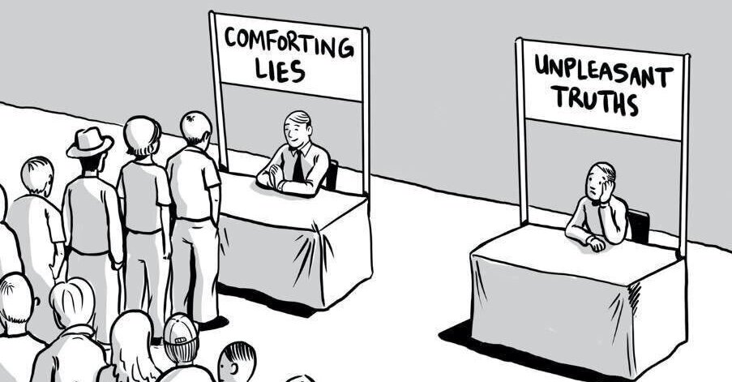
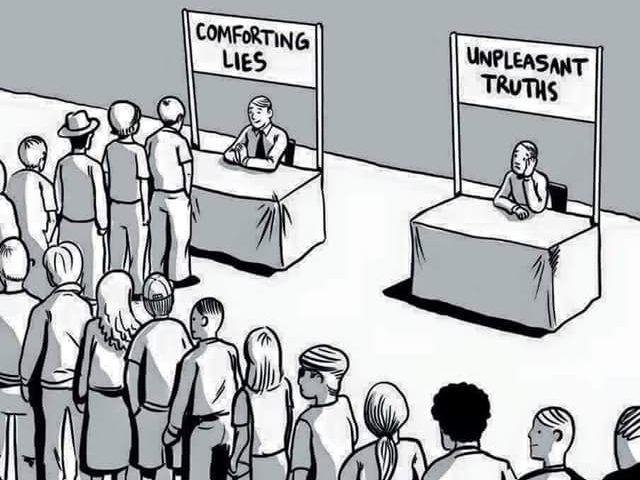
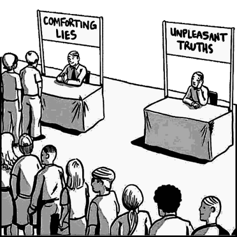
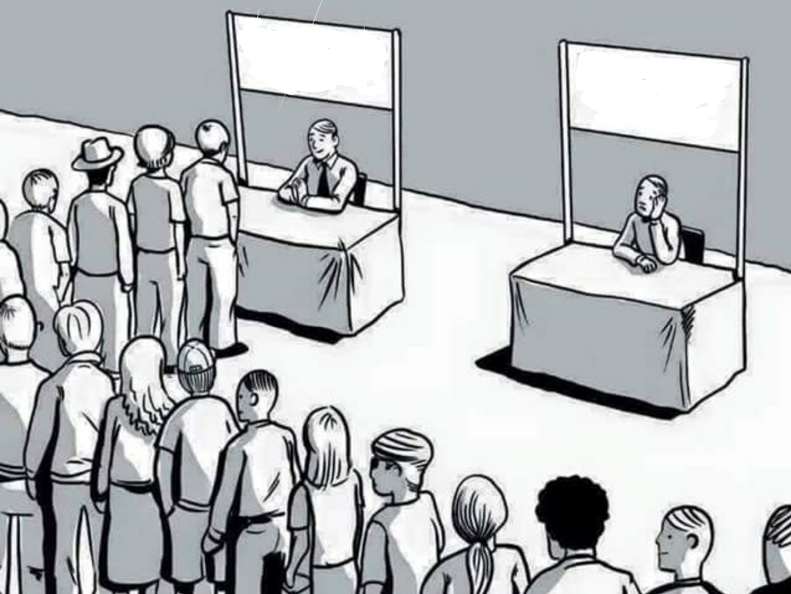
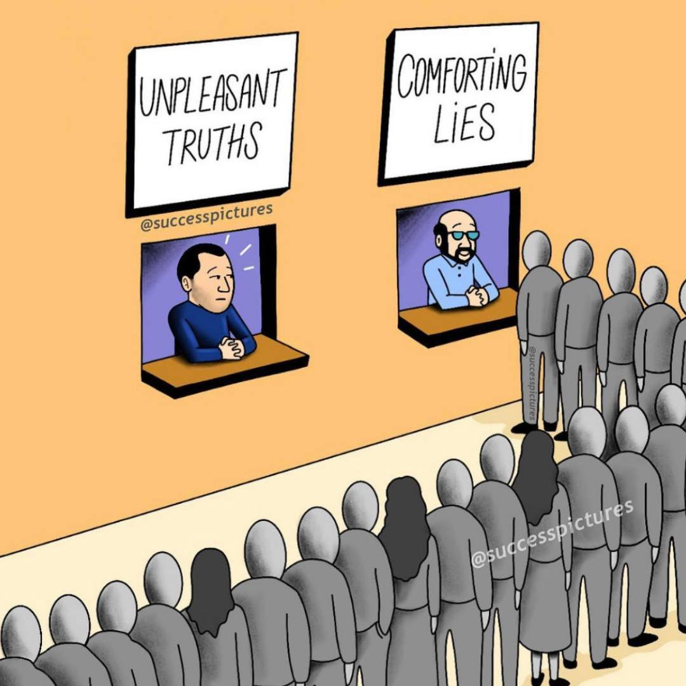
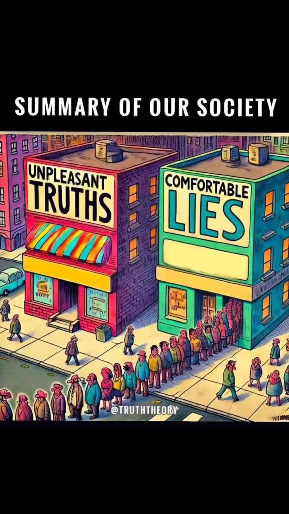
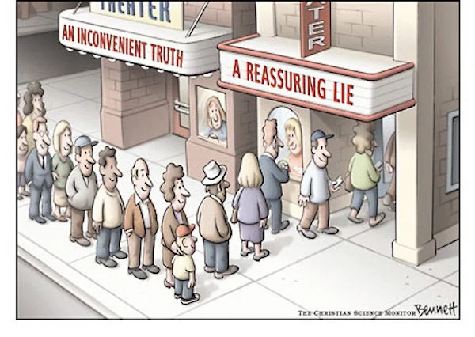
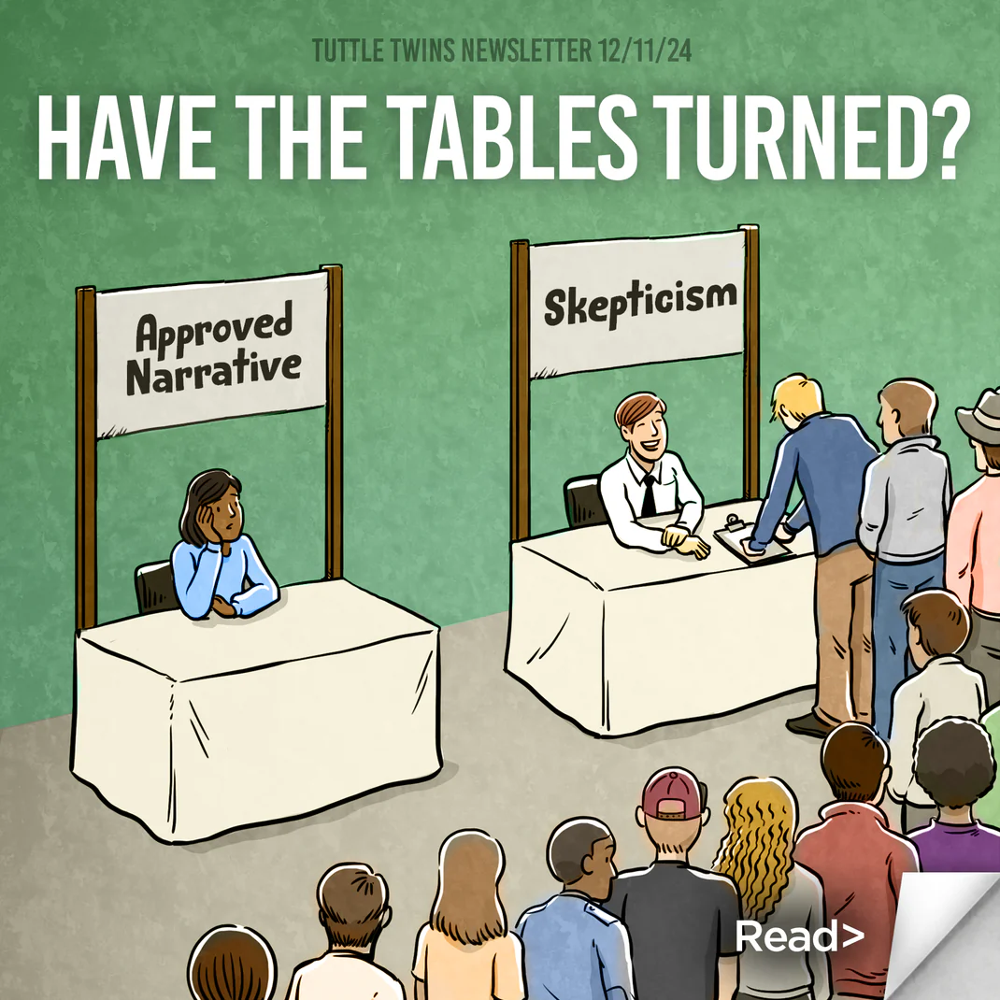

# Comforting Lies versus Unpleasant Truths

**Comforting Lies versus Unpleasant Truths** is an exploitable cartoon meme format depicting two contrasting choices: one widely preferred but deceptive (“comforting lies”) and the other avoided but accurate (“unpleasant truths”). The meme highlights the human tendency to favor emotional reassurance over difficult or inconvenient realities.

## Origin

The format derives from a broader class of **“two paths” or “choice” illustrations**, commonly used in motivational graphics and editorial cartoons. These visuals typically show a crowd moving toward an easy or popular option, while a lone individual chooses a more difficult or less appealing path.

One widely circulated version features two booths labeled “Comforting Lies” and “Unpleasant Truths,” with a long line at the former and an empty or neglected station at the latter. Another variant, published in *The Christian Science Monitor*, shows a movie theater with lines for “A Reassuring Lie” and “An Inconvenient Truth,” reinforcing the same contrast.

The exact origin of the caption “comforting lies vs. unpleasant truths” is unclear, as it appears to have emerged organically through reposts and caption edits across social media platforms in the late 2010s and early 2020s.

## Spread

The meme gained popularity on platforms such as Reddit, Twitter/X, and Instagram, where users adapted the format to comment on:

* Politics and media narratives
* Self-improvement and discipline
* Social conformity vs. independent thinking
* Epistemology (truth vs. belief)

Its flexibility allowed it to become a **caption-swappable template**, similar to other binary-choice meme formats.

## Format

The meme typically includes:

* Two labeled options (e.g., booths, roads, doors, or lines)
* A large group choosing the “comforting” or easy option
* Few or no people choosing the “truthful” or difficult option

Common caption structures include:

* “Comfort vs. Growth”
* “Illusion vs. Reality”
* “Short-term pleasure vs. Long-term fulfillment”
* “Mainstream vs. Independent thought”

## Meaning

The meme expresses a recurring philosophical and psychological idea:

> People often prefer beliefs that feel good over those that are true but uncomfortable.

It is frequently used to critique perceived conformity, denial, or avoidance of difficult realities. In some contexts, it also serves as a self-reflective or motivational message encouraging individuals to pursue truth, discipline, or long-term thinking.

## Related Memes and Concepts

### Red Pill vs. Blue Pill

From The Matrix, this concept similarly contrasts a comforting illusion (blue pill) with a harsh truth (red pill).

### The Road Not Taken

The poem by Robert Frost is often associated with the idea of choosing a less popular or more difficult path, though its original meaning is more ambiguous than commonly interpreted.

### Plato’s Allegory of the Cave

A philosophical analogy describing people who prefer comforting illusions over confronting reality.

### Cognitive Biases

* **Confirmation bias**: preferring information that aligns with existing beliefs. Also known as: Echo chamber, Filter bubble, Mental incest
* **Cognitive dissonance**: avoiding uncomfortable truths that conflict with one’s worldview

### Scientific Framing: Null vs. Alternative Hypothesis

A loosely related analogy can be drawn from scientific methodology:

* The **null hypothesis** represents the default or established assumption
* The **alternative hypothesis** represents a new or competing claim

In principle, hypotheses are evaluated based on evidence rather than preference. However, in practice, social and cognitive biases can make established ideas feel more “comfortable” or credible, while novel or unconventional ideas may be dismissed more readily. This dynamic parallels the meme’s theme of favoring familiarity over potentially disruptive truths.

### Cultural Sayings

* “The truth hurts”
* “Easy choices, hard life; hard choices, easy life”
* “Better the devil you know than the devil you don’t”

## Variations

Popular edits replace the labels with different oppositions, such as:

* Comfort vs. Pain
* Laziness vs. Hard Work
* Majority vs. Individual
* Distraction vs. Focus

Some versions depict roads diverging, lines forming, or crowds moving in one direction while a lone figure goes the other way.

## Images

