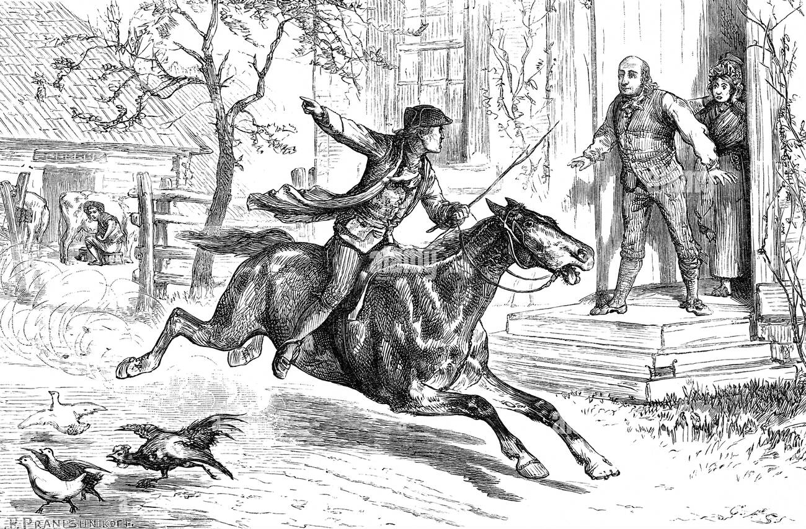
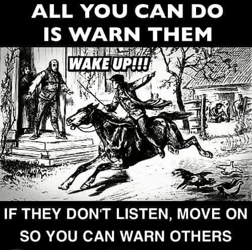

https://www.alamy.com/stock-photo-the-alarm-1775-18529002.html

The Alarm 1775

On the morning of April 20, 1775, in Ryefield, New Hampshire,  
Deacon Clyde rode his mare through the area shouting  
that the Redcoats had killed many at Concord, Massachusetts the day before  
and urging all to join the Minutemen who were assembling.

The alarm guns were also sounding the signal if the Minutemen were needed.

The American Revolution had begun.
