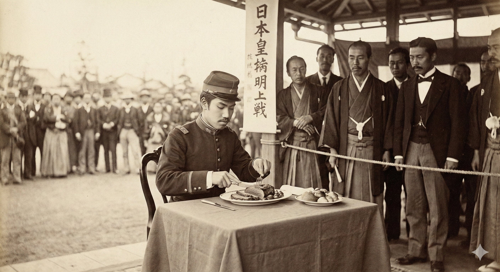

[Sama Hoole @SamaHoole](https://x.com/SamaHoole) -
[2026-01-31 13:54 +0100](https://x.com/SamaHoole/status/2017582278222762045) -
389.8K Views

1868, Japan. The Meiji Restoration begins. Emperor Meiji has one obsession: Make Japan strong enough to resist Western colonization.

His advisors study Western militaries and find something unexpected: Western soldiers are 4 inches taller and significantly stronger than Japanese soldiers.

The diagnosis: Diet. Japanese eat rice and fish. Westerners eat beef and dairy.

Emperor Meiji issues an extraordinary decree in 1872: The Emperor himself will eat beef publicly to encourage national adoption of meat-eating.

This is radical. Buddhism prohibits meat consumption. 1,200 years of religious tradition says eating meat is morally wrong.

Meiji doesn't care. He eats beef at public ceremonies. Declares meat-eating patriotic.

Traditional priests are horrified. Meiji ignores them. He's not building a religious state. He's building a military power.

The results are staggering: Within one generation, average Japanese height increases several inches. Military capacity transforms. By 1905, Japan defeats Russia - a Western power - in war.

Impossible without the dietary change. 1860s Japan couldn't have won. 1905 Japan, raised on meat, dominated.

Military analysts worldwide studied Japanese tactics, training, equipment. Almost none mentioned the nutritional revolution that enabled everything else.

Because it revealed an uncomfortable truth: Rice-eating populations lose to meat-eating populations in military conflicts.

Can't admit that without questioning the grain-based food systems feeding most of Asia.

So the Meiji meat reformation gets footnoted in history books while the military victories get analyzed endlessly.

But the Japanese military leadership knew. Post-war reports explicitly credited the dietary changes with enabling Japan's rise.

They'd run the experiment: Same genetics, same culture, different diet. The meat-eating generation defeated the European empire.

By 1920, Japan was a major world power. By 1940, they were conquering the Pacific.

Their soldiers were eating 300g of meat daily. Their enemies in China and Southeast Asia were eating rice.
The physical disparity was obvious in combat reports. Japanese soldiers had better endurance, faster recovery, superior strength.

This wasn't samurai spirit or bushido code. This was biochemistry. Meat-fed soldiers outperform grain-fed soldiers.

After World War II, the dietary advice changed. Japan was encouraged to return to traditional rice-heavy diets.

Occupation authorities explicitly promoted rice consumption and discouraged meat-eating. Called it "returning to Japanese values."

Funny how that happened after Japan demonstrated what meat-fed Asian soldiers could accomplish.

The lesson was clear: Keep populations on grain, they stay controllable. Give them meat, they become dangerous.

Meiji understood this. That's why he ate beef publicly.
The occupation understood this too. That's why they promoted rice after the war.

