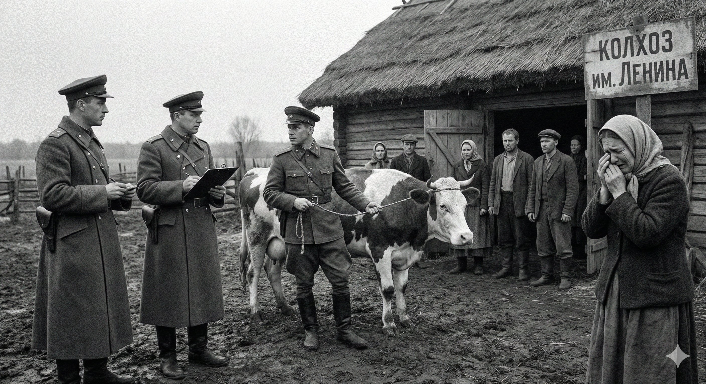

[Sama Hoole @SamaHoole](https://x.com/SamaHoole) -
[2026-02-01 07:23 +0100](https://x.com/SamaHoole/status/2017846125479289299) -
76.1K Views

1932, Soviet Union. Stalin has a problem: Ukrainian peasants own cattle and produce meat independently. This creates economic autonomy. Autonomous peasants don't submit to collectivization.

Solution: Confiscate all livestock. Force everyone onto state-provided grain rations.

The Holodomor isn't remembered as a meat confiscation. It's remembered as a grain shortage. But the sequence matters.

First: Soviets confiscate cattle, pigs, chickens. Millions of livestock slaughtered or shipped to cities.

Second: Grain quotas increased to impossible levels.

Third: Peasants, unable to supplement grain with meat, begin starving.

The grain was there. The problem was the missing protein.

Human bodies cannot survive on grain alone. You need complete protein, fat-soluble vitamins, bioavailable minerals. Grain provides none of this.

Ukrainian peasants with livestock could survive grain shortages. They had protein and fat reserves.

Ukrainian peasants without livestock died when grain ran short. No backup nutrition source.

4 million died. Not from grain shortage. From forced grain dependency after protein access was eliminated.

This pattern repeated across the Soviet Union. Nomadic herders forced into collectivized farming. Cattle confiscated. Population weakened within one generation.

Kazakh nomads lost 38% of their population during collectivization. Before: They ate meat and dairy primarily. After: Forced onto grain rations.

The survivors were notably shorter, weaker, more compliant than their parents' generation.

Stalin's government documented this in internal reports. They knew exactly what they were doing.

Grain-dependent populations cannot resist state authority effectively. They lack the physical capacity.

Meat-eating populations can sustain resistance. They have metabolic flexibility and strength.

The livestock confiscations weren't just economic policy. They were population control through nutrition.

By 1940, Soviet citizens were eating one-third the meat their parents ate in 1920. Average height had decreased. Physical capacity had declined.

The Red Army struggled against Finland in 1939 despite overwhelming numerical superiority. Finnish soldiers, eating meat and dairy-heavy diets, fought effectively. Soviet soldiers, eating grain rations, didn't.

Military analysts blamed equipment and training. Ignored that Finnish soldiers were physiologically better fueled.

The Soviet Union eventually won World War II by sheer numbers. But casualty rates were catastrophic compared to Western armies eating higher meat rations.

Post-war Soviet leadership knew this. That's why they prioritized meat production for cities while keeping rural areas grain-dependent.

Keep the countryside weak, the cities strong. Classic imperial strategy.

The Holodomor is taught as economic mismanagement. It was deliberate nutritional control.

Confiscate the livestock, force grain dependency, eliminate resistance capacity.

It worked.

