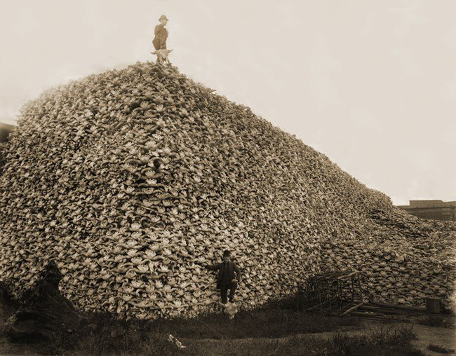

[Sama Hoole @SamaHoole](https://x.com/SamaHoole) -
[2026-02-01 15:06 +0100](https://x.com/SamaHoole/status/2017962857388757270) -
74.6K Views

1860s-1880s American West. The U.S. government has a problem: Plains Indians maintain independence through bison hunting.

Approximately 30-60 million bison provide meat year-round. Plains Indians need nothing from the U.S. government.

Complete nutritional independence enables political independence.

The military solution: Eliminate the bison. Systematically.

General William Tecumseh Sherman, 1868: "The quickest way to compel the Indians to settle down to civilized life was to send ten regiments of soldiers to the plains, with orders to shoot buffaloes until they became too scarce to support the redskins."

He wasn't being metaphorical. This was official policy.

1870-1883: Commercial hunters, often with military support, killed 50+ million bison.

Not for meat - most carcasses were left to rot. For hides, sure. But primarily: To eliminate Plains Indians' food source.

By 1884: Fewer than 300 bison remained in North America.

Plains Indians, forced onto reservations, received government rations: Flour, sugar, lard. Minimal meat.

The transformation was immediate and devastating.

Sitting Bull, 1883: "Our people were healthy and strong before the white man came. Now they are sick and weak."

Reservation agents documented the change: Diabetes appeared. Obesity emerged. Dental health collapsed. Chronic diseases proliferated.

All within one generation of dietary change.

From bison-based diet (primarily meat and fat) to government rations (primarily flour and sugar).

Military reports noted that Plains Indians on reservations were physically weaker than previous generations. Less capable of resistance.

This wasn't accidental. It was the goal.
Eliminate the bison, force grain dependency, eliminate resistance capacity.

The strategy worked perfectly. No major Plains Indian uprising after 1890.
Not because they accepted subjugation. Because they lacked the physical capacity to sustain prolonged resistance.

The bison elimination was genocide through nutrition. Destroy the food source that enables independence, replace with rations that create dependency and weakness.

It's documented explicitly in military correspondence. The goal was stated openly.

Modern American history teaches the bison elimination as environmental disaster or economic shift.

It was deliberate nutritional suppression to eliminate political resistance.

The Plains Indians understood this. Their oral histories are explicit about the connection between bison elimination and population weakening.

But American historical narrative prefers the environmental story. Less uncomfortable than admitting we starved populations into submission using grain rations.

The experiment worked. The results were documented.

Remove the meat source. Provide grain. Watch physical capacity collapse.

Plains Indians went from warrior cultures dominating the Great Plains to reservation populations with catastrophic health outcomes in one generation.

The variable: Diet changed from bison to flour.

That's not coincidence. That's cause and effect.

The bison elimination proved what every empire has known: Control protein access, control political capacity.

