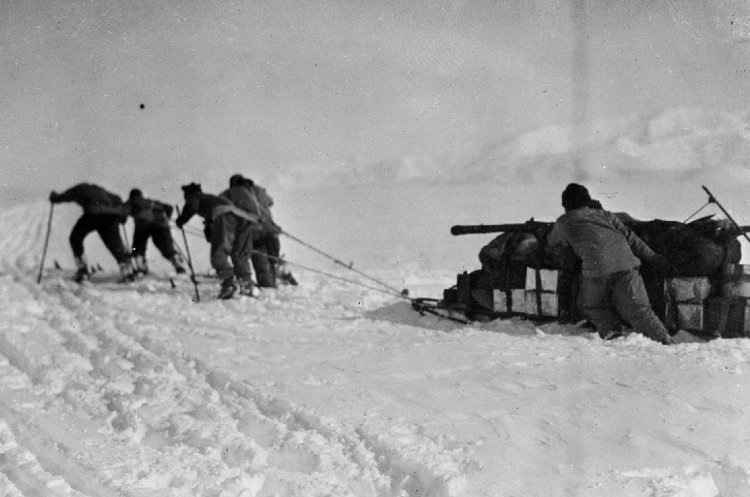

[Sama Hoole @SamaHoole](https://x.com/SamaHoole) -
[2026-02-17 14:37 +0100](https://x.com/SamaHoole/status/2023753693678760178) -
14.2K Views

1911. Two expeditions race to be first to the South Pole. Robert Falcon Scott leading the British team. Roald Amundsen leading the Norwegian team. Same goal. Same destination. Completely different dietary approaches.

Scott's provisions: British naval traditions. Pemmican, yes, but less than Amundsen. More biscuits (hardtack). More lean tinned meats. More carbohydrates. The "balanced" approach.

Amundsen's provisions: High-fat focused. More pemmican - the fattiest mix they could make. Chocolate with added butter for extra fat. He'd learned from his previous Arctic expedition: fat is non-negotiable in extreme cold.

November 1911: Both teams depart for the pole.

December 14, 1911: Amundsen reaches the South Pole first. His men are in good health. They have food remaining. The dogs (which they'd also fed high-fat pemmican) are in decent condition. They return safely to base camp.

January 17, 1912: Scott reaches the pole, 34 days after Amundsen. His men are already exhausted. They're rationing food despite being barely halfway through the journey. On the return, they begin deteriorating rapidly.

The Scott expedition's journals document it: Constant hunger despite eating their rations. Extreme fatigue. Frostbite setting in more severely than expected. They're supposed to have enough food. They're eating regularly. But they're starving.

March 1912: Scott and his remaining men die, just 11 miles from a supply depot. They had food left. One of his last journal entries mentions hunger and weakness despite eating.

Why did Amundsen succeed where Scott failed?

Nutrition researchers who've analyzed both expeditions' rations have calculated the macros:

Scott's rations: About 4,500 calories daily, roughly 30-35% from fat.

Amundsen's rations: About 4,500 calories daily, roughly 50-60% from fat.

Same total calories. Massively different fat content. Massively different outcomes.

In extreme cold doing hard physical labor, the body burns through glucose quickly. If you're relying on protein and carbs for energy, you're constantly depleted. If you're using fat as primary fuel, you're stable.

Scott's men were eating enough calories but not enough fat. In Antarctic conditions, that caloric approach killed them.

Amundsen knew: Fat is survival. Not just in the food, but in his body. His men returned with enough fat stores remaining that they could have sustained themselves longer if needed.

Scott's men burned through their limited fat stores. Then burned through muscle. Then died.

Same Antarctic conditions. Same human bodies. Different macronutrient ratios. The difference between life and death.

