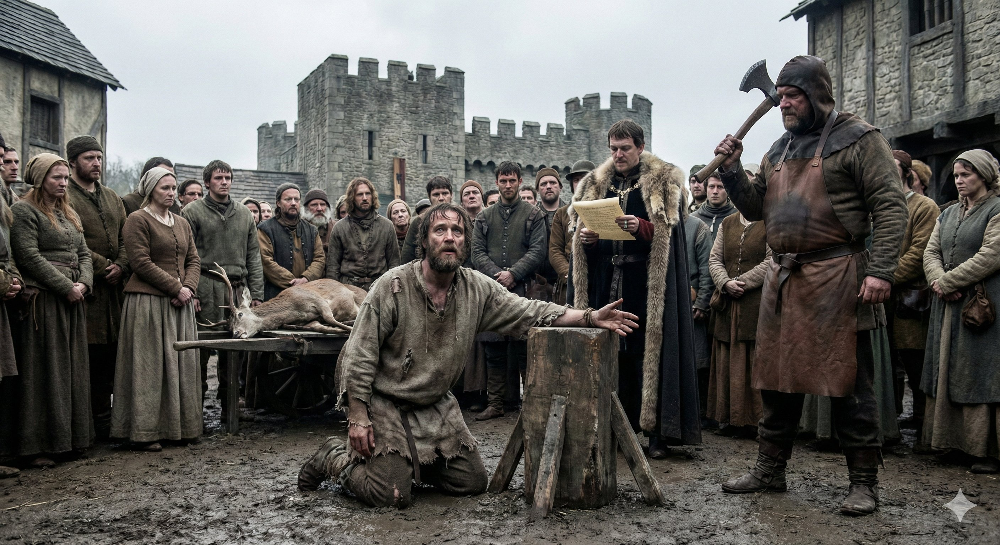

[Sama Hoole @SamaHoole](https://x.com/SamaHoole) -
[2026-02-19 17:09 +0100](https://x.com/SamaHoole/status/2024516607460909224) -
26.9K Views

Medieval England's forest laws are not discussed as often as they should be, and I think that's deliberate, because when you understand them, the entire framing of "traditional plant-based diets" collapses immediately.

William the Conqueror established the New Forest in 1079 by depopulating the villages that stood there and declaring the land royal hunting grounds. Entire communities were displaced so that the king could have somewhere to hunt deer. This was not metaphorical. Villages were demolished. People were removed. The deer were given legal protections that the people who'd been evicted no longer had.

The forest laws that followed extended this logic across enormous swathes of England. Royal forests covered up to a third of the country at their peak. Within these lands, commoners were forbidden from hunting, trapping, or even carrying a bow without permission.

The deer, the wild boar, the hare: belonged to the crown and the nobility. Poaching was not treated as a minor infraction. Depending on the period and the specific law, it could result in blinding, castration, the amputation of a hand, or hanging.

These punishments were carried out publicly. They were meant to be seen. The message was not subtle: this protein is ours. Your children can starve before you touch it.

Across the valley, through the trees they couldn't legally enter, English peasants could hear and sometimes see the animals that would have completely transformed their nutritional situation. Full-grown deer. Wild boar. Protein and fat walking freely through forests fifty yards from the fields where malnourished men were trying to grow enough grain to pay their rent and still have something left to eat.

We now look at the grain-and-vegetable diet those men ate and call it heart-healthy.

We do not discuss who made them eat it and why.

