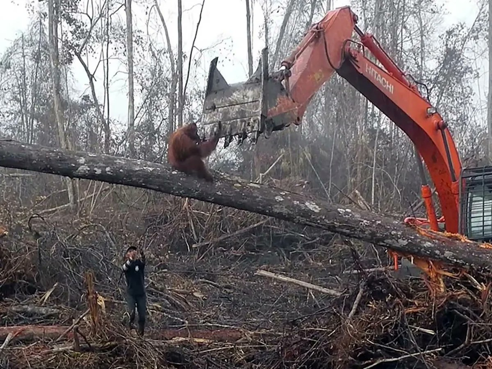

[Sama Hoole @SamaHoole](https://x.com/SamaHoole) -
[2026-02-26 12:51 +0100](https://x.com/SamaHoole/status/2026988421839770111) -
809 Views

Indonesia contains 10% of the world's remaining tropical forests. It also produces 58% of the world's palm oil.

The maths on those two facts is the environmental story of the 21st century.

Between 1990 and 2020, Indonesia lost 25 million acres of primary forest. Palm oil plantations are the single largest driver. The orangutan population has declined by 50% since 1999. Not from hunting. From habitat destruction. From cutting down the trees they live in and replacing them with oil palms.

Sumatran orangutans are now critically endangered. There are 13,000 left.

Here's the part that makes it directly relevant to your vegan shop: palm oil is in approximately 50% of all packaged products. It's in vegan butter, vegan cheese, vegan ice cream, vegan protein bars, vegan spreads. It's in the products specifically designed to avoid animal exploitation.

The peat fires are the part that doesn't get covered enough. Indonesia's peat swamps are carbon sinks that have been storing organic material for thousands of years. When you drain peat to plant oil palms, the peat oxidises and releases that stored carbon continuously. When fires start, and they start every year, the peat burns underground, sometimes for months.

In 2015, Indonesia's fires released more greenhouse gases per day than the entire US economy. For two months straight. The haze drifted across Malaysia, Singapore, and the Philippines. Schools closed. Airports shut. Indonesian authorities estimated 100,000 people died prematurely from smoke inhalation that year.

There's no palm oil in beef.

The orangutans died for the vegan aisle.

