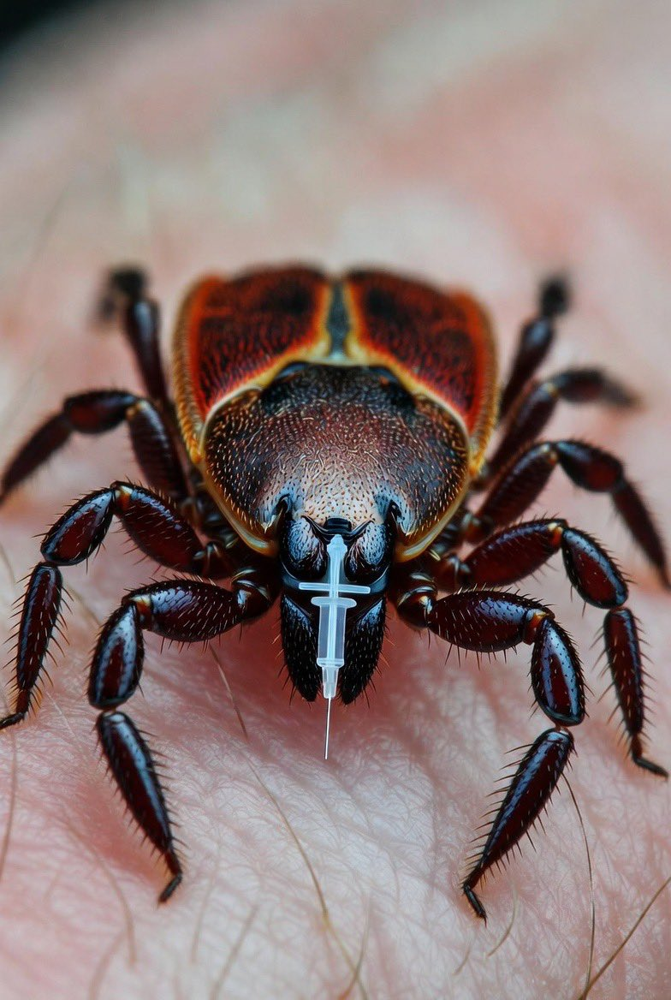
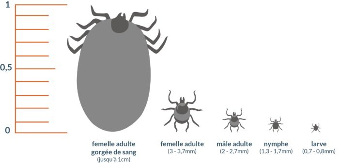

[Stern Drew @SternDrewCrypto](https://x.com/SternDrewCrypto) -
[2026-04-04 18:54 +0100](https://x.com/SternDrewCrypto/status/2040473150496878829) -
456.7K Views

🚨 THE TICK APOCALYPSE: BIO-ENGINEERED LYME WAS RELEASED TO ENSLAVE AMERICA 🚨

Just remember this cold hard truth they desperately hope you never connect.

They intentionally released bio-engineered ticks carrying Lyme disease so that you could never again enjoy the outside or hunt your own deer meat.

The US government deliberately unleashed this plague on its own citizens to make you more compliant, more dependent, and easier to rule.

Think about it.

Lyme exploded across the heartland right as patriotic Americans were rediscovering real freedom: getting off the grid, hunting wild game, raising families in nature, rejecting their toxic processed system.

Suddenly the forests became forbidden zones.

Hiking? Too risky.

Camping with your kids? Dangerous.

Harvesting your own clean venison? Forget it.

They turned God's green earth into a biological trap so you would stay locked indoors, glued to screens, pumping their pharmaceuticals, and begging for government "protection."

This was psychological warfare disguised as an insect bite.

They hate strong, self-reliant Americans who don't need their doctors, their drugs, or their permission slips.

They hate hunters, preppers, and anyone who can live free without the system.

Lyme was the perfect invisible chain: chronic, debilitating, and blamed on "nature" while the real architects in deep state labs toasted their success.

They want you weak, isolated, and terrified of the outdoors.

They want you compliant slaves who never question the agenda.

Rise above their bio-engineered prison.

Get outside anyway.

Hunt anyway.

Reclaim your birthright to nature and freedom.

Build your body back stronger.

The resistance begins the moment you refuse to live in fear of their ticks.

They did this to you on purpose.

Never forget.

---

Care Bare 🧸🏡🪴🧑‍🌾
@carebellami

Perfect time to befriend a family of mega tick eating Opossums

---

Rocketman
@X_Rocketman_

impregnate your outdoor pants and shirts, this kills them. Using it for years, an outdoor in the woods 4-5 times a week.

---

Common Senser (Lanoik)
@fraz_6

Sounds like something these sickos would conjure up to throw at humanity…
I hate ticks enough as it is.

---

Ricky Anderson👨🏻‍🏭
@Tigman74

Your government? Occupied and straight-up puppeted by that tiny little country, folks. They don't just whisper in the ear—they've got their hand so far up Uncle Sam's ass, it's waving hello from his mouth!

---

Robert Nunya
@RNunya97986

Of course there is no credible evidence any of this is real because so-called credible evidence only can be revealed by the crimminals involved. We all know thats not gonna happen. Look at their track record. It speaks for itself.

First, they have a problem with controlling peoples behavior. For example, they want you to stop eating beef. They know if you have the beef allergy you wont eat beef. They know that ticks can spread this allergen. So they pick the Lone Star tick (Amblyomma americanum) as the perfect delivery system because it already naturally carries the alpha-gal sugar in its saliva that can trigger the allergy in some people after a bite. They decide to "improve" on nature by funding secret research in labs (tying it to military programs from the 1950s–70s or modern gene-editing grants from groups like the Gates Foundation) to create or select strains of these ticks that are more aggressive, more likely to transmit high levels of the allergen, or even genetically tweaked via CRISPR to guarantee the allergy kicks in faster and stronger. Next, they mass-produce these altered ticks in controlled facilities (think Plum Island-style labs or private biotech ops) and figure out how to release them into the wild without raising suspicion—maybe through "accidental" escapes, drone drops disguised as pest control, or just letting natural populations explode in key areas by manipulating deer herds and habitats.Then the ticks get out there, bite hunters, campers, hikers, and rural folks who are living self-reliant lifestyles. The bites introduce or amplify the alpha-gal allergen, and over weeks or months, victims develop full-blown alpha-gal syndrome: delayed allergic reactions to beef, pork, lamb, and sometimes even dairy or other mammal products.The results? People stop eating beef and red meat entirely because one burger could send them to the ER with hives, swelling, or anaphylaxis. This forces a shift to plant-based or lab-grown alternatives, aligning with the bigger "agenda" of reducing meat consumption for climate control, population management, or whatever the endgame is. It creates lifelong dependency on doctors, allergy meds, and the food system they control. Psychologically, it scares people away from outdoors activities (tying back to the Lyme tick claims), making them less independent and more reliant on authority. In the end, society quietly complies without laws or force—just engineered biology doing the work.

---

F. Frank Putz
@therealFPutz

The US Government dropped plane loads of diseased Ticks in wilderness areas in the Western States.  

Ticks are wreaking havoc on wildlife in the west.

Who are these sick Bastards constantly Fucking with the health of Our Nation?

---

Carla Ford
@cford0923

When I sit back sometimes in the quietness of it all and think about what these demonic parasites has done to us and our children and families and your neighbors and fellow Americans things like this and even worse without any remorse or guilt I go to a place that I try not to go to very often because it feels so heavy but everyone that has been complicit in the most horrendous experiments on humanity should be hung from a tree in the town square yes I said it!!

---

Milan Hauth
@milahu104

> everyone that has been complicit in the most horrendous experiments on humanity should be hung from a tree in the town square yes I said it!!

a quick death would be a moderate solution.
what these terrorists would deserve in a just world are infinite amounts of torture

---

Robert Nunya
@RNunya97986

Ways to prevent tick bites.

Landscape and Habitat Modifications (Most Reliable Method)Create a "tick-safe zone" around high-traffic areas like your home, play areas, and paths. Key steps include:

Mow frequently: Keep grass short (around 3 inches) and trim vegetation close to the ground. Ticks avoid open, sunny, dry lawns.

Clear debris: Remove leaf litter, tall grasses, brush, and organic material around homes, lawn edges, stone walls, and woodpiles.

Add barriers: Place a 3-foot-wide strip of wood chips, gravel, or mulch between lawns and wooded/brushy areas. This creates a hot, dry zone that ticks struggle to cross. 

https://cdc.gov

https://phipps.conservatory.org

Prune and open up space: Trim shrubs, overhanging branches, and trees to increase sunlight and airflow (lowers humidity). Move decks, playground equipment, and seating away from yard edges and woods.

Manage hosts: Stack firewood neatly and dry; remove old furniture or trash. Fence out deer (8-foot fences work best) and discourage rodents by securing trash and bird feeders away from the house. 

https://cdph.ca.gov

These changes target the tick life cycle and have been shown to reduce populations in residential yards more reliably than other non-chemical options.

---

Big Frogster
@FrogsterBig

Here they're the size of a pinhead, these ticks are real crap. I had to have my dog ​​put down because of the disease; it attacked his nervous system.

---

Brittney Griner's Adams Apple
@BrittneyApple

I use permethrin on all my gear, shoes, clothes and Deet on skin. If they stick around the clothes too long they'll die and after a minute it renders them unable to bite. Works great and lasts a few washes.
